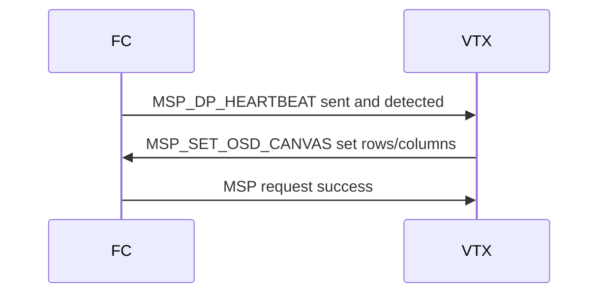
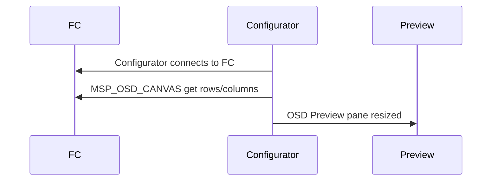

# DisplayPort MSP Extensions

Betaflight supports what is sometimes referred to as Canvas Mode whereby the OSD can send arbitrary character strings to be displayed at given screen coordinates.

## DisplayPort MSP commands

### MSP_SET_OSD_CANVAS

The MSP_SET_OSD_CANVAS command is sent by the VTX, or display device, to the FC to indicate the size of the canvas available to the DisplayPort rendering when in HD mode. HD mode, as is indicated by `vcd_video_system = HD` is automatically set on reception of this command.

| Command            | Msg Id | Direction | Notes                |
| ------------------ | ------ | --------- | -------------------- |
| MSP_SET_OSD_CANVAS | 188    | to FC     | Sets the canvas size |

| Data        | Type  | Notes                 |
| ----------- | ----- | --------------------- |
| canvas_cols | uint8 | The number of columns |
| canvas_rows | uint8 | The number of rows    |



### MSP_OSD_CANVAS

The MSP_OSD_CANVAS command is sent by the configurator to the FC to determine the size of the canvas available to the DisplayPort rendering when in HD mode. This is then used on the OSD tab to show the correct number of rows/columns when editing the OSD element positions.

| Command        | Msg Id | Direction | Notes                |
| -------------- | ------ | --------- | -------------------- |
| MSP_OSD_CANVAS | 189    | to FC     | Gets the canvas size |

Response is two bytes.

| Data        | Type  | Notes                 |
| ----------- | ----- | --------------------- |
| canvas_cols | uint8 | The number of columns |
| canvas_rows | uint8 | The number of rows    |



### MSP_DISPLAYPORT

The MSP_DISPLAYPORT command is sent by the FC to the display device/VTX to perform a DisplayPort operation.

| Command         | Msg Id | Direction | Notes                                |
| --------------- | ------ | --------- | ------------------------------------ |
| MSP_DISPLAYPORT | 182    | from FC   | DisplayPort specific commands follow |

One of the following sub-commands will then follow.

## DisplayPort sub-commands

#### MSP_DP_HEARTBEAT

| Command          | Msg Id | Notes                                                            |
| ---------------- | ------ | ---------------------------------------------------------------- |
| MSP_DP_HEARTBEAT | 0      | Prevent OSD Slave boards from displaying a 'disconnected' status |

#### MSP_DP_RELEASE

| Command        | Msg Id | Notes                                                                                                   |
| -------------- | ------ | ------------------------------------------------------------------------------------------------------- |
| MSP_DP_RELEASE | 1      | Clears the display and allows local rendering on the display device based on telemetry information etc. |

#### MSP_DP_CLEAR_SCREEN

| Command             | Msg Id | Notes             |
| ------------------- | ------ | ----------------- |
| MSP_DP_CLEAR_SCREEN | 2      | Clear the display |

#### MSP_DP_WRITE_STRING

| Command             | Msg Id | Notes          |
| ------------------- | ------ | -------------- |
| MSP_DP_WRITE_STRING | 3      | Write a string |

| Data      | Type      | Notes                                                         |
| --------- | --------- | ------------------------------------------------------------- |
| row       | uint8     | Row on which to position the first character of the string    |
| column    | uint8     | Column on which to position the first character of the string |
| attribute | uint8     | Byte indicating the font to use and if the text should flash  |
| string    | uint8 x n | NULL terminated string of up to 30 characters in length       |

The `attribute` parameter is encoded thus.

| Field                      | Bits  | Comment                                                       |
| -------------------------- | ----- | ------------------------------------------------------------- |
| Version                    | 7     | Must be 0                                                     |
| DISPLAYPORT_MSP_ATTR_BLINK | 6     | Set to have the display device automatically blink the string |
| Reserved                   | 2 - 5 | Must be 0                                                     |
| Font number                | 0 - 1 | Selects one of four fonts, each of 256 8 bit characters       |

#### MSP_DP_DRAW_SCREEN

| Command            | Msg Id | Notes                                                              |
| ------------------ | ------ | ------------------------------------------------------------------ |
| MSP_DP_DRAW_SCREEN | 4      | Triggers the display of a frame after it has been cleared/rendered |

#### MSP_DP_OPTIONS

| Command        | Msg Id | Notes                                                                                                                                                                                                            |
| -------------- | ------ | ---------------------------------------------------------------------------------------------------------------------------------------------------------------------------------------------------------------- |
| MSP_DP_OPTIONS | 5      | Not used by Betaflight. Used by INAV and Ardupilot to set display resolution. 0 = SD (30x16), 1 = HD (50x18), 2 = 30x16 SD grid centered in an HD 50x18 grid (HDZero uses), 3 = 60x22 ( used by INAV / DJI WTF ) |

#### MSP_DP_SYS

| Command    | Msg Id | Notes                                                                  |
| ---------- | ------ | ---------------------------------------------------------------------- |
| MSP_DP_SYS | 6      | Display system element displayportSystemElement_e at given coordinates |

| Data           | Type  | Notes                                                          |
| -------------- | ----- | -------------------------------------------------------------- |
| row            | uint8 | Row on which to position the first character of the string     |
| column         | uint8 | Column on which to position the first character of the string  |
| system_element | uint8 | System element to be rendered by the VTX/goggle/display device |

`system_element` will be one of the following as defined by `displayPortSystemElement_e `. Once one MSP_DP_SYS sub-command has been received by the VTX/goggle/display device then the default system elements should no longer be displayed in their default locations, but only explicitly as directed by this command. In this way, the default behavior is as before, but as soon as any system element is explicitly positioned these OSD elements behave just like any other and can be called up is specific locations by any given OSD profile.

```
// System elements rendered by VTX or Goggles
typedef enum {
    DISPLAYPORT_SYS_GOGGLE_VOLTAGE = 0,
    DISPLAYPORT_SYS_VTX_VOLTAGE = 1,
    DISPLAYPORT_SYS_BITRATE = 2,
    DISPLAYPORT_SYS_DELAY = 3,
    DISPLAYPORT_SYS_DISTANCE = 4,
    DISPLAYPORT_SYS_LQ = 5,
    DISPLAYPORT_SYS_GOGGLE_DVR = 6,
    DISPLAYPORT_SYS_VTX_DVR = 7,
    DISPLAYPORT_SYS_WARNINGS = 8,
    DISPLAYPORT_SYS_VTX_TEMP = 9,
    DISPLAYPORT_SYS_FAN_SPEED = 10,
    DISPLAYPORT_SYS_COUNT,
} displayPortSystemElement_e;
```
