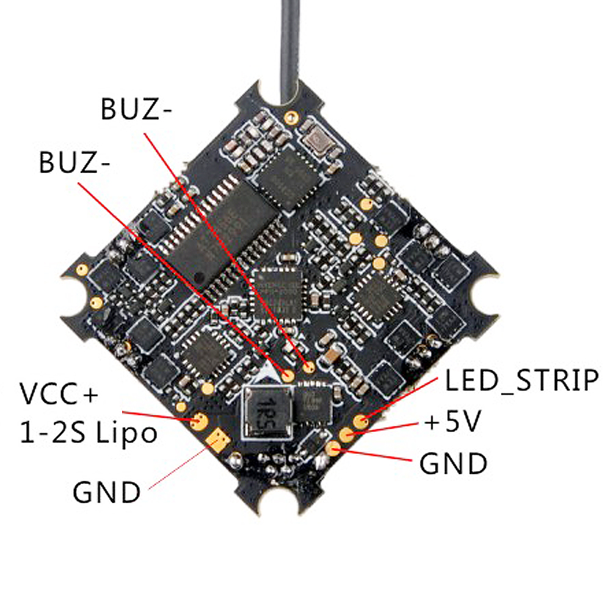
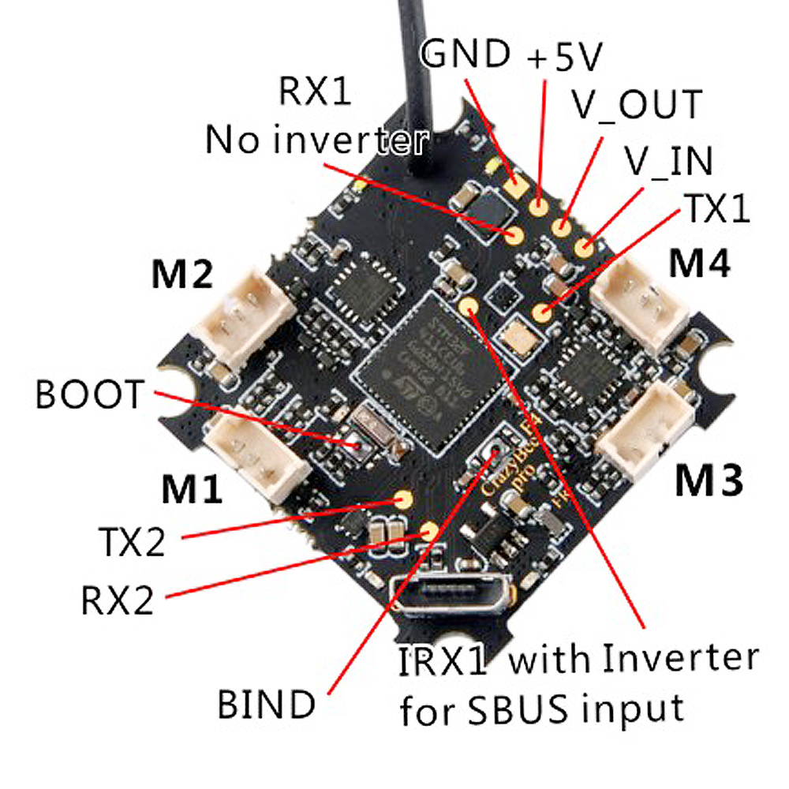

# CrazyBee F4 FR Pro

## Description

CrazyBee F4 FR Pro flight controller is a Highly integrated board(Receiver/4in1 ESC/OSD/Current Sensor) for 1~2S Whoop brushless racing drone.

## MCU, Sensors and Features

### Hardware and Features

- MCU: STM32F411CEU6 (100MHZ, 512K FLASH)
- IMU: MPU6000 (SPI)
- OSD: Betaflight OSD
- Battery Voltage Sensor: yes
- Power supply: 1-2S battery input (DC 3.5-8.7V)
- Built-in 5V 1A Buck / Boost with LC filter
- Integrated Current sensor：Max 28A,Current meter scale set to 1175
- Built-in SPI Frsky receiver with telemetry(D8/D16 switchable)
- Integrated inverter for sbus(when use external rx) in UART1 RX
- Integrated 4x Blheli_s ESC: Max 5A per ESC(EMF8BB21F16G)
- ESC Connector: 3-pin, PicoBlade 1.25mm pitch
- Beeper output: 2-pin, soldering pad
- 4 Rx Indicating LEDs: 2 x red and 2 x white
- Board size: 28.5 \* 28.5mm

## Resource mapping

| Label            | Pin  | Timer     | DMA | Default | Note |
| ---------------- | ---- | --------- | --- | ------- | ---- |
| MPU6000_INT_EXTI | PA1  |           |     |         |      |
| MPU6000_CS_PIN   | PA4  |           |     |         | SPI1 |
| MPU6000_SCK_PIN  | PA5  |           |     |         | SPI1 |
| MPU6000_MISO_PIN | PA6  |           |     |         | SPI1 |
| MPU6000_MOSI_PIN | PA7  |           |     |         | SPI1 |
| OSD_CS_PIN       | PB12 |           |     |         | SPI2 |
| OSD_SCK_PIN      | PB13 |           |     |         | SPI2 |
| OSD_MISO_PIN     | PB14 |           |     |         | SPI2 |
| OSD_MOSI_PIN     | PB15 |           |     |         | SPI2 |
| RX_CS_PIN        | PA15 |           |     |         | SPI3 |
| RX_SCK_PIN       | PB3  |           |     |         | SPI3 |
| RX_MISO_PIN      | PB4  |           |     |         | SPI3 |
| RX_MOSI_PIN      | PB5  |           |     |         | SPI3 |
| RX_GDO0_PIN      | PC14 |           |     |         |      |
| BIND_PLUG_PIN    | PB2  |           |     |         |      |
| RX_LED_PIN       | PB9  |           |     |         |      |
| PWM1             | PB8  | TIM2, CH3 |     |         |      |
| PWM2             | PB9  | TIM4, CH1 |     |         |      |
| PWM3             | PA3  | TIM4, CH2 |     |         |      |
| PWM4             | PA2  | TIM4, CH3 |     |         |      |
| VBAT_ADC_PIN     | PB0  |           |     |         | ADC1 |
| CURRENT_ADC_PIN  | PB1  |           |     |         | ADC1 |
| BEEPER           | PC15 |           |     |         |      |
| UART1 TX         | PA9  |           |     |         |      |
| UART1 RX         | PA10 |           |     |         |      |
| UART2 TX         | PA2  |           |     |         |      |
| UART2 RX         | PA3  |           |     |         |      |

## Manufacturers and Distributors

- Manufacturers: http://www.happymodel.cn/
- Distributors: Will add soon...

## Designers

## Maintainers

## FAQ & Known Issues

FRSKY Version:

- To bind to your Taranis, you need to be running the non-eu OpenTX version, which allows you to use the required D8 setting to bind to the RX. The factory default BF receiver mode is FRSKY_X, so remember to configure this if needed.
- FrSky X (8 / 16 channels) and FrSky D (8 channels) work both reliably, including in combination with crash flip / Dshot beacon, as long as the TELEMETRY feature is disabled;
  Basic telemetry information like RSSI and battery voltage will be sent even when the TELEMETRY feature is disabled;
- On FrSky D, the TELEMETRY feature causes occasional dropouts, depending on how many sensors (BARO, GPS, ...) are enabled, probably due to a timing overrun;
- On FrSky X, the TELEMETRY feature causes hard lockups due to a bug in the telemetry generation code.

## Other Resources

- User Manual: http://www.happymodel.cn/wp-content/uploads/2019/01/CrazyBee-F4FR-Pro-Frsky-version-Manual-.pdf
