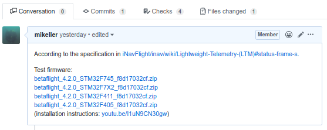

# Welcome to the Development Section

## Find Everything Betaflight Related

:::caution Work in progress

This site is still new and is very much a work in progress. Pages going to be added, updated and improved pretty every day in the weeks to come. So if you're missing something, please be patient. It will come! You can also help us out, check out the `#documentation` channel on the [Discord server](https://discord.betaflight.com/invite) for more info.

:::

## Contributing

Contributions are welcome and encouraged. The best place to start is the [Discord server](https://discord.betaflight.com/invite), specifically in the [**Development section**](https://discord.com/channels/868013470023548938/1073533061330915328). You can contribute in many ways:

- Implementation of a new feature in the firmware or in the configurator (see [below](#development));
- Documentation updates and corrections
- How-To guides - received help? Help others!
- Bug reporting & fixes;
- New feature ideas & suggestions;
- Providing a new translation for the configurator, or help us maintain the existing ones (see [below](#translators)).

Besides the Discord server, the next best place to look out for is the GitHub issue tracker:

- [Firmware issues](https://github.com/betaflight/betaflight/issues)
- [Configurator issues](https://github.com/betaflight/betaflight-configurator/issues)
- [Blackbox Log Viewer issues](https://github.com/betaflight/blackbox-log-viewer/issues)
- [Documentation issues](https://github.com/betaflight/betaflight.com/issues)

Before creating new issues please check to see if there is an existing one already. Otherwise you risk wasting people's time when they could be coding instead!

If you want to contribute to our efforts financially, please consider making a donation to us through [PayPal](https://paypal.me/betaflight).

If you want to contribute financially on an ongoing basis, you should consider becoming a patron for us on [Patreon](https://www.patreon.com/betaflight).

## Development

This document is primarily for developers.

Contribution of bugfixes and new features is encouraged. Please be aware that we have a thorough review process for pull requests, and be prepared to explain what you want to achieve with your pull request.
Before starting to write code, please read this document and the [coding style definition](development/CodingStyle).

GitHub actions are used to run automatic builds

## Translators

We want to make Betaflight accessible for pilots who are not fluent in English, and for this reason we are currently maintaining translations into 21 languages for the Betaflight App: Català, Dansk, Deutsch, Español, Euskera, Français, Galego, Hrvatski, Bahasa Indonesia, Italiano, 日本語, 한국어, Latviešu, Português, Português Brasileiro, Polski, Русский язык, Svenska, 简体中文, 繁體中文.
We have got a team of volunteer translators who do this work, but additional translators are always welcome to share the workload, and we are keen to add additional languages. If you would like to help us with translations, you have got the following options:

- If you would like to help by suggesting some updates or improvements to translations in a language you are familiar with, head to [crowdin](https://crowdin.com/project/betaflight-configurator) and add your suggested translations there
- If you would like to start working on the translation for a new language, or take on responsibility for proof-reading the translation for a language you are very familiar with, please head over to the Betaflight [Discord server](https://discord.betaflight.com/invite), and join the translation channel in the [Development section](https://discord.com/channels/868013470023548938/1073533061330915328) - the people in there can help you to get a new language added, or set you up as a proof reader

## General Principles

1. Name everything well.
2. Strike a balance between simplicity and not-repeating code.
3. Methods that start with the word 'find' can return a null, methods that start with 'get' should not.
4. Keep methods short - it makes it easier to test.
5. Don't be afraid of moving code to a new file - it helps to reduce test dependencies.
6. Avoid noise-words in variable names, like 'data' or 'info'. Think about what you're naming and name it well. Don't be afraid to rename anything.
7. Avoid comments that describe what the code is doing, the code should describe itself. Comments are useful however for big-picture purposes and to document content of variables.
8. If you need to document a variable do it at the declaration, don't copy the comment to the `extern` usage since it will lead to comment rot.
9. Seek advice from other developers - know you can always learn more.
10. Be professional - attempts at humor or slating existing code in the codebase itself is not helpful when you have to change/fix it.
11. Know that there's always more than one way to do something and that code is never final - but it does have to work.

It is also advised to read about clean code, here are some useful links:

- http://cleancoders.com/
- http://en.wikipedia.org/wiki/SOLID_%28object-oriented_design%29
- http://en.wikipedia.org/wiki/Code_smell
- http://en.wikipedia.org/wiki/Code_refactoring
- http://www.amazon.co.uk/Working-Effectively-Legacy-Robert-Martin/dp/0131177052

## Unit Testing

Ideally, there should be tests for any new code. However, since this is a legacy codebase which was not designed to be tested this might be a bit difficult.

If you want to make changes and want to make sure it's tested then focus on the minimal set of changes required to add a test.

Tests currently live in the `test` folder and they use the google test framework.
The tests are compiled and run natively on your development machine and not on the target platform.
This allows you to develop tests and code and actually execute it to make sure it works without needing a development board or simulator.

This project could really do with some functional tests which test the behavior of the application.

All pull requests to add/improve the testability of the code or testing methods are highly sought!

Note: Tests are written in C++ and linked with firmware's C code. All code is also instrumented using gcov to make test coverage analysis possible.

### Running the Tests

The tests and test build system is very simple and based off the googletest example files, it will be improved in due course. From the root folder of the project simply do:

```
make test
```

You can also do:

```
make junittest
```

This will build a set of executable files in the `obj/test` folder, one for each `*_unittest.cc` file.
It will stop after first compile/build error. If you want it to continue with the next test module you can use `make -k test`.

After they have been executed by the make invocation, you can still run them on the command line to execute the tests and to see the test report. Test reports will also be produced in form of junit XML files, if tests are built and run with the "junittest" goal. Junit report files are saved in obj/test directory and has the following naming pattern test_name_results.xml, for example: obj/test/battery_unittest_results.xml

You can also step-debug the tests in eclipse and you can use the GoogleTest test runner to make building and re-running the tests simple.

The tests are currently always compiled with debugging information enabled, there may be additional warnings, if you see any warnings please attempt to fix them and submit pull requests with the fixes.

Tests are verified and working with GCC 4.9.3

## Using Git and Github

Ensure you understand the github workflow: https://guides.github.com/introduction/flow/index.html

Please keep pull requests focused on one thing only, since this makes it easier to merge and test in a timely manner.

If you need help with pull requests there are guides on github here:

https://help.github.com/articles/creating-a-pull-request/

The main flow for a contributing is as follows:

1. Login to github, go to the betaflight repository and press `fork`;
2. Then using the command line/terminal on your computer: `git clone <url to YOUR fork>`;
3. `cd betaflight`;
4. `git checkout master`;
5. `git checkout -b my-new-code`;
6. Make changes;
7. `git add <files that have changed>`;
8. `git commit`;
9. `git push origin my-new-code`;
10. Create pull request using github UI to merge your changes from your new branch into `betaflight/master`;
11. Repeat from step 4 for new other changes.

The primary thing to remember is that separate pull requests should be created for separate branches. Never create a pull request from your `master` branch.

Once you have created the PR,
every new commit/push in your branch will propagate from your fork into the PR in the main github/betaflight repo.
Checkout another branch first if you want something else.

Push will often fail if you edit or squash commits in a branch already pushed. Never do such things after creating the PR.

Later, you can get the changes from the betaflight repo into your `master` branch by adding betaflight as a git remote and merging from it as follows:

1. `git remote add betaflight https://github.com/betaflight/betaflight.git`
2. `git checkout master`
3. `git fetch betaflight`
4. `git merge betaflight/master`
5. `git push origin master` is an optional step that will update your fork on github

You can also perform the git commands using the git client inside Eclipse. Refer to the Eclipse git manual.

### Providing Test Targets for Pull Requests

If you open a pull request for the betaflight repository that contains a change that can be tested by other users, please build a set of test firmware files for all Unified Targets and attach them to the pull request. The required firmware files can be built in zipped form ready for upload to GitHub with `make unified_zip`. When attaching test firmware files, you can point users to this video for instructions on how to install the test firmware: https://youtu.be/I1uN9CN30gw

Example of a pull request with test firmware attached:



### IDEs and .gitignore

The project' `.gitignore` file already ignores certain artifacts from some IDEs, but if you'd like to use something else, you can set up git to ignore the necessary files at a global level (all git projects on the computer)

It is always good to check that you haven't done this already: `git config --global --get core.excludesfile`

For Linux/BSD/OSX: `git config --global core.excludesfile '~/.gitignore'`

For Windows: `git config --global core.excludesfile '%USERPROFILE%\.gitignore'`

When you `git config --global --get core.excludesfile` a second time, you should get a file location back.

### Building a Hex File Locally

Given the roll out of the CLOUD BUILD platform, there is a need for those of you who want to build locally to add in the options for selecting the features you want. Surprisingly this has always been there in the form of the `EXTRA_FLAGS` command line parameter for `make`. The cloud building platform merely makes use of this parameter - extensively.

The best way to demonstrate this is to give an example:

```
make TARGET=STM32F411 EXTRA_FLAGS="-DUSE_GPS -DUSE_LED_STRIP"
```

The above would make a F411 target hex with GPS and LED_STRIP included. Happy compiling! :). For the most part simply `make` with the MCU target will include almost everything. The exception is the lower flash MCUs, e.g. F411 and F722. These do not have the flash space for everything, so even building locally you will need to specify what you would like included.

:::note

Please note the use of `-D` and the `USE_`. This differs from the way in which the configurator displays theses options.

:::

These defines that we add, either on the command line or in the custom defines (in expert mode) in the configurator, are called `gates`, and include or exclude whole sections of code.

If you want to locally compile the default compile time configuration for a given manufacturer you can do so by:

```
make CONFIG=BETAFLIGHTF7
```

This will build you a target hex file that has everything baked in for that manufacturers configuration, including any default features as specified by the manufacturer.
