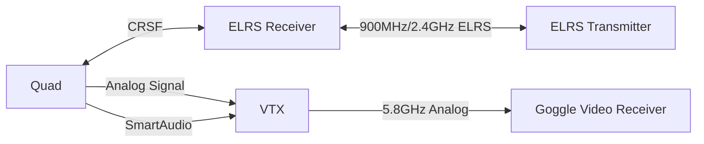

import Tabs from '@theme/Tabs'
import TabItem from '@theme/TabItem'

# MDX Reference

### Capitalisation

Capitalisation of the top level Heading and Filename of an .mdx file is mandatory, or the commit will fail. The required capitalisation will be indicated in the commit failure message.

Capitalisation should be otherwise be consistent throughout the document, and ideally across the whole site.

Capitalisation should be applied to proper names or defined or technical terms, but not otherwise. For example, "Tasks", when capitalised, may be appropriate when referring to the Configurator "Tasks" tab, or a "Tasks" function, whereas "tasks", uncapitalised, would be more appropriate in the sense that "when controlling a drone, the pilot undertakes many tasks".

Some technical terms have standard capitalisation, eg SmartAudio, DShot, HDZero, ExpressLRS, and we should be consistent with these.

# Header 1

## Header 2

### Header 3

#### Header 4

##### Header 5

###### Header 6

Normal text.

Normal text after empty line.
Normal text on next line.

_italic text_

**bold text**

**_bold italic text_**

~~strikethrough text~~

> blockquote

<br/>

- list item 1
- list item 2
  - list item 2a
  - list item 2b
- list item 3

some text

1. numbered list item 1
1. numbered list item 2
   1. numbered list item 2a
   1. numbered list item 2a
1. numbered list item 3
   <br/>
   A coded break is to separate text from ordered lists

Inline code: `const foo = 'bar';`

Code block:

```
const foo: string = 'bar'
```

````
# MDX Reference

# Header 1

## Header 2

### Header 3

#### Header 4

##### Header 5

###### Header 6

Normal text.

Normal text after empty line.
Normal text on next line.

_italic text_

**bold text**

**_bold italic text_**

~~strikethrough text~~

> blockquote

<br/>

- list item 1
- list item 2
    - list item 2a
    - list item 2b
- list item 3

some text

1. numbered list item 1
1. numbered list item 2
    1. numbered list item 2a
    1. numbered list item 2a
1. numbered list item 3
<br/>
A coded break is to separate text from ordered lists

`const foo = 'bar';`

\```
const foo: string = 'bar';
\```

\{/_ wow so meta _/}
````

## Tabs

<Tabs>
	<TabItem value="tab1" label="Tab 1" default>
		This is tab 1
	</TabItem>
	<TabItem value="tab2" label="Tab 2">
		This is tab 2
	</TabItem>
	<TabItem value="tab3" label="Tab 3">
		This is tab 3
	</TabItem>
</Tabs>

```html
<Tabs>
  <TabItem value="tab1" label="Tab 1" default> This is tab 1 </TabItem>
  <TabItem value="tab2" label="Tab 2"> This is tab 2 </TabItem>
  <TabItem value="tab3" label="Tab 3"> This is tab 3 </TabItem>
</Tabs>
<!-- even more meta -->
```

## Admonitions

:::note
This is a note. It notes things.
:::

:::caution
This is a caution. It cautions things.
:::

:::danger
This is a danger. It is dangerous.
:::

:::info
This is an info. It informs things.
:::

:::tip
This is a tip. It tips things.
:::

## Mermaid Flow Charts



## $\LaTeX$ Equations

Let $f\colon[a,b]\to\R$ be Riemann integrable. Let $F\colon[a,b]\to\R$ be
$F(x)=\int_{a}^{x} f(t)\,dt$. Then $F$ is continuous, and at all $x$ such that
$f$ is continuous at $x$, $F$ is differentiable at $x$ with $F'(x)=f(x)$.

This is a block of aligned $\LaTeX$ equations:

$$
\begin{align}
    \nabla \cdot \vec{\bf{E}} &= \frac{\rho}{\epsilon_0} \\
    \nabla \cdot \vec{\bf{B}} &= 0 \\
    \nabla \times \vec{\bf{E}} &= - \frac{\partial \vec{\bf{B}}}{\partial \mathrm{t}} \\
    \nabla \times \vec{\bf{B}} &= \mu_0 \left( \vec{\bf{J}} + \epsilon_0 \frac{\partial \vec{\bf{E}}}{\partial \mathrm{t}} \right)
\end{align}
$$

## Images

<p align="center">**Fig. 1** - centered image.</p>
 
```md
<p align="center">
  
  **Fig. 1** - centered image.
</p>
```
