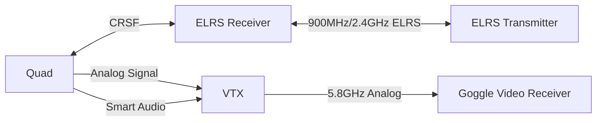

import Tabs from '@theme/Tabs';
import TabItem from '@theme/TabItem';

# MDX Reference

# Header 1
## Header 2
### Header 3
#### Header 4
##### Header 5
###### Header 6

```js
const foo = 'bar';
```

```ts
const foo: string = 'bar';
```

```md
# MDX Reference

# Header 1
## Header 2
### Header 3
#### Header 4
##### Header 5
###### Header 6

\```js
const foo = 'bar';
\```

\```ts
const foo: string = 'bar';
\```

wow so meta
```

```html
<Tabs>
	<TabItem value="tab1" label="Tab 1" default>
		This is tab 1
	</TabItem>
	<TabItem value="tab2" label="Tab 2">
		This is tab 2
	</TabItem>
	<TabItem value="tab3" label="Tab 3">
		This is tab 3
	</TabItem>
</Tabs>
<!-- even more meta -->
```

<Tabs>
	<TabItem value="tab1" label="Tab 1" default>
		This is tab 1
	</TabItem>
	<TabItem value="tab2" label="Tab 2">
		This is tab 2
	</TabItem>
	<TabItem value="tab3" label="Tab 3">
		This is tab 3
	</TabItem>
</Tabs>

:::note

This is a note. It notes things.

:::

:::caution

This is a caution. It cautions things.

:::

:::danger

This is a danger. It is dangerous.

:::

:::info

This is an info. It informs things.

:::

:::tip

This is a tip. It tips things.

:::

