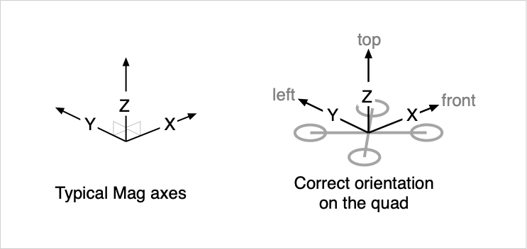

# Magnetometer / Compass notes for Betaflight 4.6

:::warning
Do NOT enable a magnetometer unless you have confirmed:

- that it is oriented correctly
- that the calibration is accurate
- that the returned values are clean and noise-free
- that the heading returned by the mag is correct
  :::

## Introduction

The purpose of a magnetometer is to return the 'heading' of the quad, the direction it is pointing in. More precisely, we want the angle in degrees between the nose of the quad and North. When set up correctly, the returned value should, for example, be 90 degrees when the nose of the quad is pointing due East, 180 degrees when pointing due south, etc.

Mag information is essential for position hold, which we intend to support.

GPS Rescue does not require Mag data, but heading control may be improved if reliable, accurate Mag information is available, especially during descents on windy days. Note: DO NOT enable Mag if you rely on GPS rescue, unless you are ABSOLUTELY CERTAIN that the Mag data is accurate and reliable, and have confirmed that enabling Mag makes a significant improvement in rescue behaviour!

## What is a Magenetometer?

A magnetometer is a three-axis device that detects the strength of the earth's magnetic field on each of three orthogonal sensor axes.

Magnetometers output data on three axes: X, Y and Z. Typically, these axes are arranged as follows:

- Y is 90 degrees to the left of X
- Z is up

The reported value for the field strength on any particular axis will be positive, and maximal, when it is closely aligned with the axis of the local magnetic field, and is pointing towards the North of that field. It will be maximally negative when aligned with the South of the local magnetic field.

The orientation of the magnetometer on the quad is very important. In Betaflight, the data from the magnetometer must be provided as follows:

- X forward
- Y left
- Z up

Fig 1 - Mag axes and orientation

If the magnetometer cannot be physically positioned so that it's axes are aligned as per the diagram above, the `Mag alignment` setting in Configurator (`align_mag` in CLI) may be used to correct for unusual Mag orientations. For example, some GPS units mount the mag unit upside down.

Correct orientation for a given axis can be confirmed by checking the Magnetometer data in the Sensors tab.

## About the earth's magnetic field vector

The magnetic field of the earth doesn't simply point North and South, and is not parallel to the ground.

It is a vector that usually points a few degrees away from true North, and points either down into the ground in the Northern Hemisphere, or up out of the ground in the Southern Hemisphere. There are considerable angular deviations, depending upon where you are on the surface of the Earth.

The sideways deviation of the Earth's magnetic field from true north is called the `magnetic declination`. It is measured in degrees, with positive values meaning that the magnetic North is to the East of true North.

The angle at which the field points into, or out of, the Earth's surface, is called the `magnetic inclination`, or `magnetic dip`. See [physicsmax.com](https://physicsmax.com/inclination-dip-7371) for a nice explanation and graphic. Incination is measured in degrees; positive values point 'into' the earth. In the Northern Hemisphere the Earth's magnetic field points down into the ground (positive inclination values), and in the Southern Hemisphere it points up into the sky (negative inclination values).

Local declination and inclination values are available from online sources such as [NOAA](https://www.ngdc.noaa.gov/geomag/calculators/magcalc.shtml), or via clickable map at sites like [magnetic-declination.com](https://www.magnetic-declination.com).

As an example, in Sydney, Australia, 34 degrees South and 151 degrees East, the Earth's magnetic field is 13 degrees east of true North, and points out of the ground, steeply upwards, at 65 degrees. With a properly calibrated and correctly oriented Mag, a maximallly positive value on the Mag X axis should be seen in the Sensors tab, and close to zero on the Y and Z axes, when the nose of my quad is pointed 13 degrees East of North, and 65 degrees up.

The absolute strength of the field is measured in Gauss, or milliTeslas, where 10 Gauss = 1 milliTesla. In my location, the field strength is approximately 0.57 Gauss. Betaflight's sensors tab shows different numbers, perhaps due to internal scaling factors. Absolute field strength is not important for heading calculations.

## Hardware and connection

Flight / FC firmware must be specially built to include `Magnetometers` for the cloud build, or `-DUSE_MAG` for local builds, otherwise there will be no Mag support in the firmware on the FC.

Betaflight supports the following magnetometers:

- [AK8963](https://www.alldatasheet.com/datasheet-pdf/pdf/535561/AKM/AK8963.html) and [AK8975](https://www.alldatasheet.com/datasheet-pdf/pdf/535562/AKM/AK8975.html), (both discontinued; some versions have Z up, others down)
- [HMC5883L](https://cdn-shop.adafruit.com/datasheets/HMC5883L_3-Axis_Digital_Compass_IC.pdf) and [QMC5883L](https://datasheet.lcsc.com/szlcsc/QST-QMC5883L-TR_C192585.pdf). These are provided on the common, and cheap, GY-217 module, and many GPS units.
- [IST8310](https://intofpv.com/attachment.php?aid=8104)
- [STM's LIS3MDL](https://www.st.com/resource/en/datasheet/lis3mdl.pdf)

`set mag_hardware = AUTO` in CLI is the default, and will automatically identify a connected and supported Mag.

The magnetometer is usually connected via i2C. Wire up the SCL and SDA pins on the module to the pins of the same name on the FC, and power the module with either 5V or 3.3V depending what it needs.

When connected by i2C, the following CLI settings are needed:

- `set mag_bustype = I2C`
- `set mag_i2c_address = 0` (automatically determine from the connected Mag)
- `set mag_i2c_device = 1` (always 1, not sure why)

When a Magnetometer is hooked up and is successfully connected:

- Mag can be enabled in the System Configuration part of the Configuration tab in Configurator, and then:
- the Mag hardware icon at the top (N with triangle above it) will illuminate
- Mag Alignment settings are available in the top right of the Configuration tab in Configurator
- in the Sensors tab, enabling Magnetometer at the top will display the current X, Y and Z magnetometer values
- the `status` command in CLI will show the detected Mag hardware

:::tip
The Accelerometer must always be enabled when using a Mag, to correct the heading estimate for pitch or roll variations!
:::

## Magnetometer Mounting and Orientation

As noted previously, Betaflight expects to receive magnetic field information on the basis that the X axis of the Mag points forward, the Y axis of the mag points left, and the Z axis points up. If this is not correctly configured, the Mag data will be useless, and could cause a GPS rescue to fail.

If you have an external Mag module that can be mounted in any angle you like, eg a GY-271, mount it:

- centrally
- flat to the quad, ie in the same plane of the FC
- as far as possible away from motors and other metallic onjects
- with the X axis pointing forward, directly to the nose of the quad, with Y left and Z up

If the Mag is provided with a GPS module, the above requirements also apply. Additionally, make sure the GPS is flat to the quad, otherwise you'll be messing with custom alignment settings. Also note that the Mag sensor may be inverted, or in an unknown orientation; it will be absolutely essential to confirm the alignment properly before using the Mag!

:::tip
When the Mag orientation (alignment) is correct, the 'quad' icon in the Home screen of Configurator should move fairly smoothly and appropriately as the quad is rotated, pitched and rolled. Note that when the quad's attitude is changed very quickly, the heading will initially react quickly on the basis of Gyro and Acc data, and then over the next half second it will be adjusted by the Mag. If the orientation of the Mag data axes is wrong, or the calibration is way off, then these movements will be jerky or completely wrong.
:::

A simple orientation check is described in the 'tip' above.

If the orientation is known to be correct, ie X forward etc, because you can see the orientation markings on the board or have confirmed them by checking the little dot on the sensor, then the default or `CW0` alignment should be correct.

If you're unsure, or if you know it is rotated, or upside down, the `Mag alignment` setting in Configurator (`align_mag` in CLI) will need to be configured properly:

- if the mag is upright but rotated 90 degrees right, choose `CW90`, etc
- if the mag is inverted, choose one of the 'flip' options.

Note that 'flip' functionally rotates the Mag 180 degrees around the Y axis. You pretty much have to experiment with each possible orientation and hope, after checking, that you can find one that works. For the HMC5883L/QMC5883L, [this post](https://intofpv.com/t-betaflight-internals-coordinate-system?pid=55575#pid55575) shows a 'cheat sheet' that may help, but only if the chip itself is visible.

### Checking Magnetometer Orientation using Configurator's Sensors Tab

The Sensors Tab shows the current X, Y and Z Mag field strength values as detected by the sensor.

:::note
Before checking orientation, the sensor must first be calibrated!  
The calibration does not have to be perfect, but it must be done at least once.
:::

When a particular axis is perfectly aligned with the local magnetic field, the other two axes will show zero, or very close to zero. If the value shown is positive, that axis is pointing towards the North of the magnetic field. If negative, it's pointing South.

We can use this fact to check the orientation of the Mag after it is attached to the quadcopter. It's best to do this well away from large ferrous metal objects, eg out in an open field or something like that.

We need to know the 'north' direction of the Earth's magnetic field, approximately, at our location, so that we can point the nose of the quad kind of directly into that magnetic field vector when we go looking at the data returned by our Mag.

First, get your phone out, open it's Compass app, and mark a line on the bench or ground or whatever that points due North/South. Then draw a second line that takes into account the magnetic Declination for your location. In my case, some 13 degrees east of true North. That declination-adjusted line is the direction that Magnetic North will be in.

Second, look up your local Inclination value. If you're in the Northern Hemisphere, you'll be pointing the nose of the quad downwards at that angle into the ground, along the North/South magnetic line, when testing the X axis of your sensor. If you're in the Southern Hemisphere, you'll be pointing at that angle up into the sky.

Then hook the quad up to Configurator, check the Sensors tab, point the nose of the quad as best possible directly into the magnetic field.

If everything is perfect, you should see a large, positive value in the X axis, and smaller, close to zero values in the Y and Z axes. With a bit of adjustment of the angle of the quad, you should be able to get the Y and Z axes really close to zero. If you figure that the nose of the quad looks like it's pointing North, and at the correct angle to the Horizon, and if X is by far the biggest number, then the X axis is aligned correctly!

You can then turn the quad 90 degrees right, pointing the 'left side' of the quad, where the Y axis of the sensor should be, directly to Magnetic North. If all is good, the Y axis data will be a big number and X and Z close to zero.

Finally, hold the quad so that the top of it is pointing directly into the magnetic field vector. By now you should have a good idea where that is. Z should then have a strongly positive value while X and Y should be close to zero.

Complex as this process seems, it is the only way to be 100% sure that the Mag is oriented correctly.

If you do not get the expected outcome, then try with different mag alignment options, until it works out as described above. I'm sure someone will make a video of this. Once you've done it a few times, it's quick and easy enough.

## Magnetometer Calibration

Magnetometers must always be calibrated after being placed on the quad, before use, and before checking/confirming the orientation. A quick calibration is all that's needed before confirming the orientation, but a very accurate calibration may be useful if the accuracy of your heading estimate is important.

Calibration is needed because there can be very significant offsets in the magnetic field strength as detected by the sensor, mostly due to nearby metallic elements in the frame of the quad or on the circuit boards themselves.

The outcome of a calibration run is a set of values adjust 'centre' of the range of values detected for each axis. Once the correct calibration value is applied, all readings on that axis should be centered around zero. The maximum (most positive) and minimum (most negative) values for each axis should then be equal in value, but opposite in sign.

Cal values are saved in the `mag_calibration` CLI parameter. Once aquired, the cal values adjust the Mag values that are used to calculate the heading of the quad. For example, `set mag_calibration = 35,-130,-75` will cause the heading code to first subtract 35 from every X reading, add 130 to every Y reading, and add 75 ro every Z reading.

For the most accurate calibration results:

- calibrate the quad at, or close to, the intended flight location
- keep well away from metallic or magnetic objects
- get a long USB cable and don't have magnetic objects on your body or in your pockets
- do several runs, and confirm that the cal values are consistent each time
- (expert only) validate that absolute min and max readings are equal on each axis

Calibration values should not need to change much from flying area to area, within your local district. They may require updating or checking in areas of high magnetism or very variable local field strength.

:::note:
Calibration itself DOES NOT check that the orientation of the sensor is correct!
:::

### Calibration using the 'calibrate Magnetometer` button in Configurator.

This method is the quickest and easiest way to calibrate the sensor. It's best to do several runs and to check that the values you get are consistent.

The quad should be rotate in all possible vectors, so that each axis of the sensor gets pointed in all possible directions in relation to the earth's field. 30s is provided to acquire samples. The software can calculate cal values from from the array of values acquired during the test.

Do not rotate the frame too fast, or too slowly. Smoothly completing full rotations about every 1.5-2 seconds works best. Try to ensure that, for example, the nose of the quad points in all possible directions during the 30s period. This will ensure that the other axes also point in all possible directions.

Sometimes aiming to pitch flip the quad in a north-south plane in relation to the known magnetic field for half the time, nose over tail, then turning the quad 90 degrees and roll-flipping the quad left over right, can give reliable results, but you'll then need to be reasonably sure you have a good 'feel' for the orientation of the field in your area.

Check the `mag_calibration` CLI parameter after each run to see how consistent the values are. If each value is within 50 units of the last couple of runs, that's pretty good.

If accuracy is important, you can choose to average the values in the most consistent runs. It's also possible to explicitly focus on rotating on pitch alone in the magnetic field axis, trying to get consistent X and Z values, and choosing the most consistent numbers there; then rotating on roll alone, again aiming to traverse the magnetic field axis frequently, until you get consistent Y and Z values.

### Checking and fine-tuning the calibration in Sensors tab.

Once you get consistent values from your calibration tests, the pilot can validate the accuracy of the cal factor by checking that the absolute minimum and maximum values are, for a given axis, equal. This must be done in the exact same location that the original calibration was performed at, ideally soon after, or at the same time.

This is done by carefully pointing, say, the nose of the quad carefully and directly into the magnetic field, while checking the X axis numbers in the sensors tab. When the Y and Z values are zero, or close to zero, the X value will be biggest. Note the biggest positive value that you see. Then rotate the quad 180 degrees, and note the most negative value that you see. If the cal factor is 'perfect' these values will be equal, but opposite. If the difference is small, it can be ignored. If you are a perfectionist, you can adjust the cal value for X in the CLI, manually, and try again. This process can be repeated for each of the three axes.

Using the sensors tab in this manner to check max and min for each axis will also identify whether the existing calibration is suitable for a new location, or not. If max and min are very close to equal, you don't need to recalibrate.

## What about my 'heading' information? And signal noise?

Heading information is provided to the quad by the GPS unit (course over ground), the IMU (gyro information while turning quickly), and the Mag unit. The IMU code uses 'sensor fusion' methods to integrate this data to a final 'attitude' or 'heading' value for the quad.

If the code is built with GPS support, and a GPS Uart is enabled, you can log the heading information from GPS and Mag, while flying, with the GPS Heading debug.

The reported Mag heading can be seen in Debug 4 of the GPS Heading Debug in the Sensors tab, but only if GPS support exists in the build. We will most likely show Mag heading in other debugs, just haven't done that yet.

Incoming mag X, Y and Z values are always logged to Blackbox, and should be examined to ensure they are not really noisy. The noise should be much less than the signal. If noise is obviously an issue, mount the mag further away from the motors, ensuring that the sensor is equidistant from pairs of motors, and check that there is adequate filtering on the power supply to the Mag module.

---

Drafted by ctzsnooze 2023-09. Huge shout out to ledvinap and pichim for their help and guidance.
