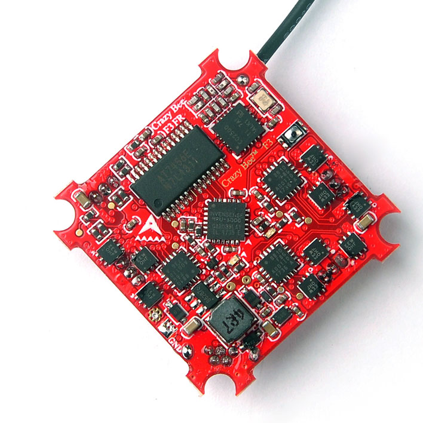
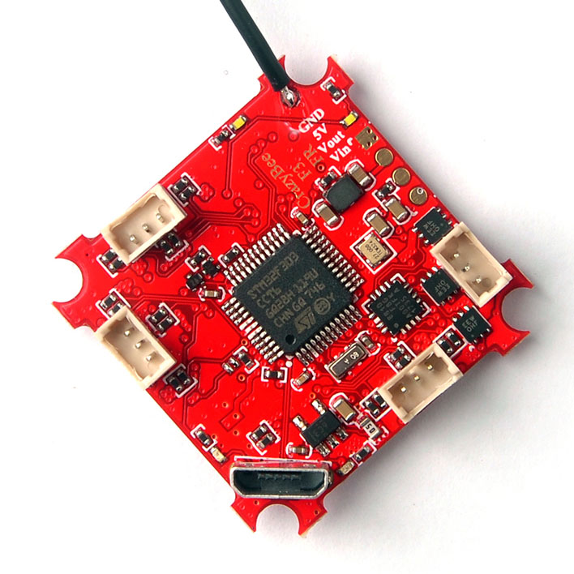

# CrazyBee F3 FR

## Description

CrazyBee F3 flight controller is a Highly integrated board for 1S Whoop brushless racing drone.
It might be the world first Tiny whoop size brushless flight controller which integrated Receiver/4in1 ESC/OSD/Current Meter.

## MCU, Sensors and Features

### Hardware and Features

- MCU: STM32F303CCT6
- IMU: MPU6000 (SPI)
- IMU Interrupt: yes
- VCP: yes
- OSD: Betaflight OSD
- Battery Voltage Sensor: yes
- Integrated Voltage Regulator: yes, booster, 5V/800mA
- Integrated Current sensor：Max 14A, could be modified to 28A by replace resistor
- Integrated Frsky compatible receiver: Frsky_D(D8) and Frsky_X(D16) switchable mode
- Buttons: 1 (Receiver bind button)
- Integrated 4x Blheli_s ESC: Max 5A per ESC
- ESC Connector: 3-pin, PicoBlade 1.25mm pitch
- Beeper output: 2-pin, soldering pad
- 4 Rx Indicating LEDs: 2 x red and 2 x white

## Resource mapping

| Label            | Pin  | Timer     | DMA | Default | Note                 |
| ---------------- | ---- | --------- | --- | ------- | -------------------- |
| MPU6000_INT_EXTI | PC13 |           |     |         |                      |
| MPU6000_CS_PIN   | PA4  |           |     |         | SPI1                 |
| MPU6000_SCK_PIN  | PA5  |           |     |         | SPI1                 |
| MPU6000_MISO_PIN | PA6  |           |     |         | SPI1                 |
| MPU6000_MOSI_PIN | PA7  |           |     |         | SPI1                 |
| OSD_CS_PIN       | PB1  |           |     |         | SPI1                 |
| OSD_SCK_PIN      | PA5  |           |     |         | SPI1                 |
| OSD_MISO_PIN     | PA6  |           |     |         | SPI1                 |
| OSD_MOSI_PIN     | PA7  |           |     |         | SPI1                 |
| RX_CS_PIN        | PB12 |           |     |         | SPI2                 |
| RX_SCK_PIN       | PB13 |           |     |         | SPI2                 |
| RX_MISO_PIN      | PB14 |           |     |         | SPI2                 |
| RX_MOSI_PIN      | PB15 |           |     |         | SPI2                 |
| RX_GDO0_PIN      | PA8  |           |     |         |                      |
| RX_BIND_PIN      | PA9  |           |     |         |                      |
| RX_LED_PIN       | PA10 |           |     |         |                      |
| PWM1             | PB8  | TIM8, CH2 |     |         |                      |
| PWM2             | PB9  | TIM8, CH3 |     |         |                      |
| PWM3             | PA3  | TIM2, CH4 |     |         |                      |
| PWM4             | PA2  | TIM15,CH1 |     |         |                      |
| VBAT_ADC_PIN     | PA0  |           |     |         | ADC1                 |
| RSSI_ADC_PIN     | PA1  |           |     |         | ADC1                 |
| BEEPER           | PC15 |           |     |         |                      |
| UART3 TX         | PB10 |           |     |         | will add pinout soon |
| UART3 RX         | PB11 |           |     |         | will add pinout soon |

## Manufacturers and Distributors

https://www.banggood.com/Racerstar-Crazybee-F3-Flight-Controller-4-IN-1-5A-1S-Blheli_S-ESC-Compatible-Frsky-D8-Receiver-p-1262972.html

## Designers

## Maintainers

## FAQ & Known Issues

- The board specifications claim DSHOT600-ready, but due to the use of a type L (BB1 24MHz) ESC, only DSHOT300 is reliably supported, although DSHOT600 seems to be working for quite a few people. But just how clean that ESC control signal is when using DSHOT600, is untested. For a discussion on this, see https://www.rcgroups.com/forums/showthread.php?3036325-Racerstar-Crazybee-F3-Ultimate-Micro-AIO-FC%21-1S-5A-BlheliS-Frsky-Flysky-OSD/page3 .
- The factory default GYRO / PID config is 8KHz / 2KHz . There are reports that this may lead to possible instability and 4KHz / 4KHz is recommended.

Specific information for the factory supplied Betaflight 3.3.0 version:

- The DSHOT beeper function does not work.
- When turtle mode ("Flip over after Crash") is activated, the FC will only arm if the failsafe timeout is 1s (10 \* 0.1s) or more. If the timeout is set lower than that, you may see the motors shortly try to spin up and then stop, and then the quad will not be armed. Rumour has it that this is fixed in BF 3.4 .

FRSKY Version:

- To bind to your Taranis, you need to be running the non-eu OpenTX version, which allows you to use the required D8 setting to bind to the RX. The factory default BF receiver mode is FRSKY_X, so remember to configure this if needed.
- FrSky X (8 / 16 channels) and FrSky D (8 channels) work both reliably, including in combination with crash flip / DShot beacon, as long as the TELEMETRY feature is disabled;
  Basic telemetry information like RSSI and battery voltage will be sent even when the TELEMETRY feature is disabled;
- On FrSky D, the TELEMETRY feature causes occasional dropouts, depending on how many sensors (BARO, GPS, ...) are enabled, probably due to a timing overrun;
- On FrSky X, the TELEMETRY feature causes hard lockups due to a bug in the telemetry generation code.

## Other Resources

User Manual: http://img.banggood.com/file/products/20180209021414Crazybeef3.pdf
