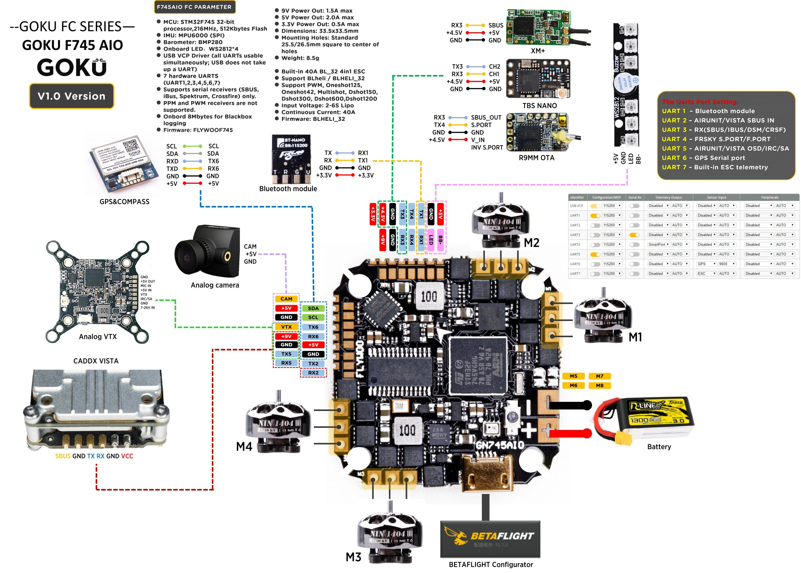

# FLYWOOF745AIO

FLYWOOF745AIO is used for v1.2 of the GN745 AIO board, for v1.0 the base FLYWOOF745 target should be used which has a slightly different motor output mapping.
This board use the STM32F745VGT6 microcontroller and have the following features:

- High-performance and DSP with FPU, ARM Cortex-M7 MCU with 1024 Kbytes Flash
- 216 MHz CPU,462 DMIPS/2.14 DMIPS/MHz (Dhrystone 2.1) and DSP instructions, Art Accelerator, L1 cache, SDRAM
  MPU6000 gyro
- 32bit ESC using STM32F051 with BLHELI_32, can be programmed to AM32 using the iFlight F051 target and PB4 bootloader.
- The 16M byte SPI flash for data logging
- USB VCP and boot select button on board(for DFU)
- Stable voltage regulation,9V/2A DCDC BEC for VTX/camera etc.And could select 5v/9v with pad
- Serial LED interface(LED_STRIP)
- VBAT/CURR/RSSI sensors input
- Suppose IRC Tramp/SmartAudio/FPV Camera Control/FPORT/telemetry
- Supports SBus, Spektrum1024/2048, PPM. No external inverters required (built-in).
- Supports I2C device extend(baro/compass/OLED etc)(socket)
- Supports GPS (socket)

### All uarts have pad on board

| Value | Identifier | RX   | TX   | Notes                          |
| ----- | ---------- | ---- | ---- | ------------------------------ |
| 1     | USART1     | PA10 | PA9  | FOR SBUS IN(inverter build in) |
| 2     | USART2     | PD6  | PD5  | USE FOR TRAMP/SmartAudio       |
| 3     | USART3     | PB11 | PB10 | USE FOR GPS                    |
| 4     | USART4     | PA1  | PA0  | PAD USE FOR TRAMP/SmartAudio   |
| 5     | USART5     | PD2  | PC12 | PAD ESC sensor                 |
| 6     | USART6     | PC7  | PC6  | PAD                            |
| 7     | USART7     | PE7  | PE8  | PAD                            |

### I2C with GPS port together.Use for BARO or compass etc

| Value | Identifier | function | pin | Notes           |
| ----- | ---------- | -------- | --- | --------------- |
| 1     | I2C1       | SDA      | PB7 | with GPS outlet |
| 2     | I2C1       | SCL      | PB6 | with GPS outlet |

### Buzzer/LED output

| Value | Identifier | function | pin  | Notes |
| ----- | ---------- | -------- | ---- | ----- |
| 1     | LED0       | LED      | PC15 |
| 2     | BEEPER     | BEE      | PC14 |

### VBAT input with 1/10 divider ratio,Current signal input,Analog/digit RSSI input

| Value | Identifier | function | pin | Notes |
| ----- | ---------- | -------- | --- | ----- |
| 1     | ADC1       | VBAT     | PC3 |       |
| 2     | ADC1       | CURR     | PC2 |       |
| 3     | ADC1       | RSSI     | PC5 |       |

- FLYWOO TECH
- www.flywoo.net
