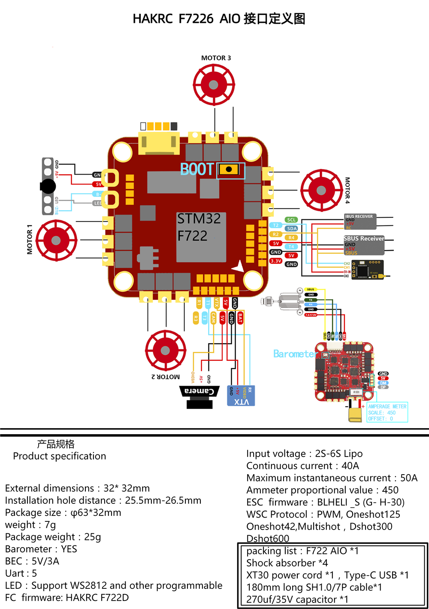
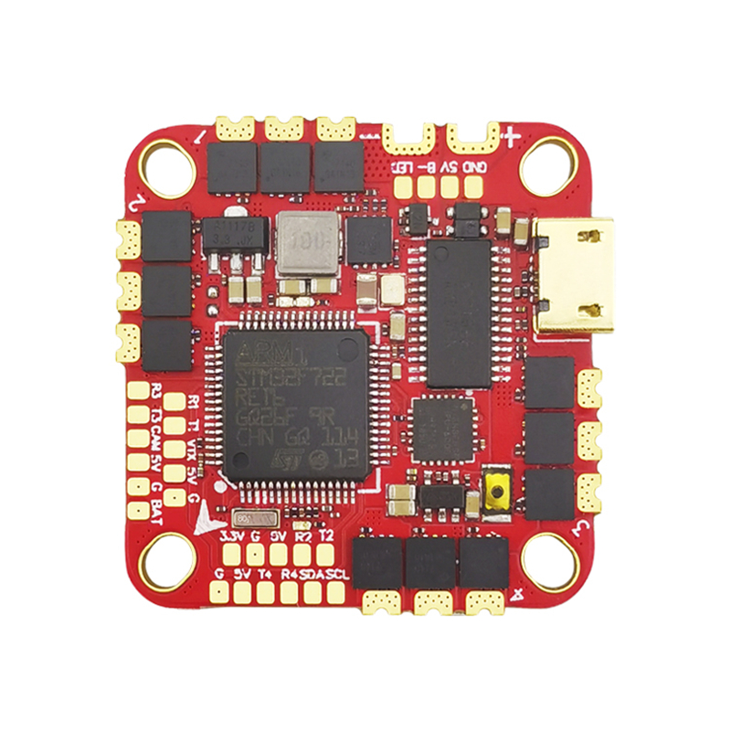
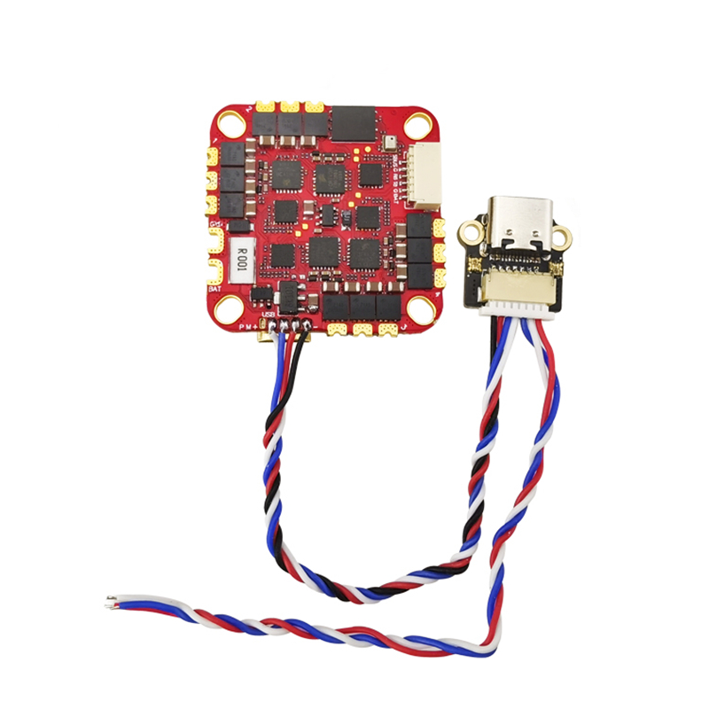

# HAKRCF722D

### Hardware and Features

- SCPU: STM32F722RET6
- IMU: ICM42688
- OSD: AT7456E
- Barometer: integrated
- BEC: 5V/3A
- Uart: 5
- LED: Support WS2812 and other programmable
- Sensor: Built-in current sensor

The HAKRC F722D is somewhat unique due to the use of an external USB-C plug and LED pads which connect to the FC via JST plugs. These enable USB connection when the FC is enclosed in the airframe.

## Manufacturers and Distributors

HAKRC Loopur

## Designers

HAKRC Loopur
