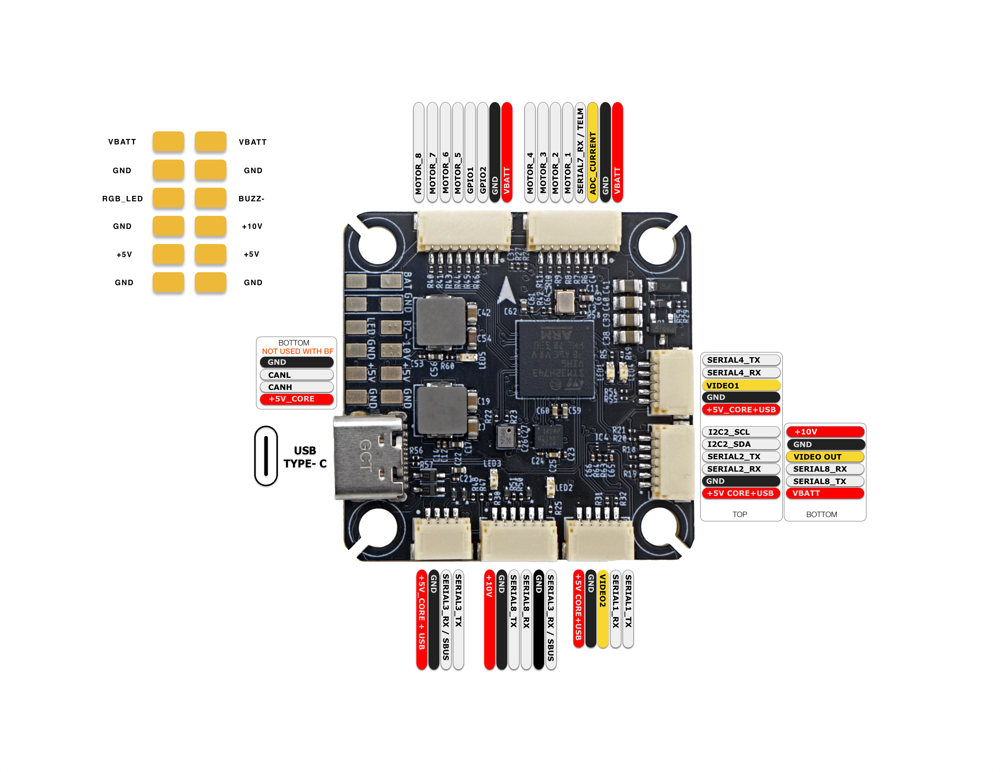

import Tabs from '@theme/Tabs'
import TabItem from '@theme/TabItem'
import SpecGrid from '@site/src/components/SpecGrid'

# AEDROX H7

<Tabs>

<TabItem value="specifications" label="Specifications" default>

<SpecGrid>

</SpecGrid>

## Other Features

- SD Card Slot: No
- Onboard Receiver: No
- Hardware Inverter: No
- Bluetooth: No
- WiFi: No
- Onboard RGB LED: 1x Pad
- Camera Switch: Yes

## Information

:::info

[AEDROX Documentation](https://aedrox.com)

:::

## Input/Output

- USB Connector:
  USB Type-C
- Motor Outputs:
  8x
- UARTs:
  6x
- I2C:
  Yes
- SWD:
  Yes
- SPI:
  No
- 3.3V Output:
  Yes
- 4.5V (VBUS) Output:
  No
- 5V Output:
  2.3A
- 10V Output:
  2.3A (GPIO controlled)
- Current Sensor:
  Yes
- Analog RSSI Input:
  No
- LED Strip Output:
  Yes
- Buzzer Output:
  Yes
- GPIO:
  2x

## Connectors

### Motors 1-4

| Pin # | Name            | Label  | Notes         |
| ----- | --------------- | ------ | ------------- |
| 1     | Battery Voltage | VBATT  |               |
| 2     | Ground          | GND    |               |
| 3     | Current         | CUR    | ADC Current   |
| 4     | Telemetry       | RX7    | ESC Telemetry |
| 5     | Signal 1        | Motor1 |               |
| 6     | Signal 2        | Motor2 |               |
| 7     | Signal 3        | Motor3 |               |
| 8     | Signal 4        | Motor4 |               |

### Motors 5-8

| Pin # | Name            | Label  | Notes |
| ----- | --------------- | ------ | ----- |
| 1     | Battery Voltage | VBATT  |       |
| 2     | Ground          | GND    |       |
| 3     | GPIO 2          | GPIO2  | PINIO |
| 4     | GPIO 1          | GPIO1  | PINIO |
| 5     | Signal 5        | Motor5 |       |
| 6     | Signal 6        | Motor6 |       |
| 7     | Signal 7        | Motor7 |       |
| 8     | Signal 8        | Motor8 |       |

### GPS/Compass

| Pin # | Name    | Label | Notes |
| ----- | ------- | ----- | ----- |
| 1     | 5V      | +5V   |       |
| 2     | Ground  | GND   |       |
| 3     | UART 2  | RX2   |       |
| 4     | UART 2  | TX2   |       |
| 5     | I2C SDA | SDA   |       |
| 6     | I2C SCL | SCL   |       |

### CAM1

| Pin # | Name    | Label  | Notes |
| ----- | ------- | ------ | ----- |
| 1     | 5V      | +5V    |       |
| 2     | Ground  | GND    |       |
| 3     | Video 1 | Video1 |       |
| 4     | UART 4  | RX4    |       |
| 5     | UART 4  | TX4    |       |

### CAM2

| Pin # | Name    | Label  | Notes |
| ----- | ------- | ------ | ----- |
| 1     | 5V      | +5V    |       |
| 2     | Ground  | GND    |       |
| 3     | Video 2 | Video2 |       |
| 4     | UART 1  | RX1    |       |
| 5     | UART 1  | TX1    |       |

### HD VTX

| Pin # | Name   | Label | Notes |
| ----- | ------ | ----- | ----- |
| 1     | 10V    | +10V  |       |
| 2     | Ground | GND   |       |
| 3     | UART 8 | TX8   |       |
| 4     | UART 8 | RX8   |       |
| 5     | Ground | GND   |       |
| 6     | UART 3 | RX3   |       |

### Receiver

| Pin # | Name   | Label | Notes |
| ----- | ------ | ----- | ----- |
| 1     | 5V     | +5V   |       |
| 2     | Ground | GND   |       |
| 3     | UART 3 | RX3   |       |
| 4     | UART 3 | TX3   |       |

### Analog VTX

| Pin # | Name            | Label     | Notes |
| ----- | --------------- | --------- | ----- |
| 1     | 10V             | +10V      |       |
| 2     | Ground          | GND       |       |
| 3     | Video Out       | Video Out |       |
| 4     | UART 8          | RX8       |       |
| 5     | UART 8          | TX8       |       |
| 6     | Battery Voltage | VBATT     |       |

### Debug

| Pin # | Name  | Label | Notes         |
| ----- | ----- | ----- | ------------- |
| 1     | 3.3V  | 3V3   | Pad on bottom |
| 2     | SWDIO | IO    | Pad on bottom |
| 3     | SWCLK | CK    | Pad on bottom |

</TabItem>

<TabItem value="wiring" label="Wiring Diagrams">

</TabItem>

<TabItem value="photos" label="Photos">

</TabItem>

<TabItem value="notes" label="Notes">

## OSD Support

Analog OSD and HD OSD are sharing SERIAL8.

## VTX Power Control

PINIO3 controls the VTX BEC output marked "10V". This power source is present on the HD VTX, Analog VTX ports and a solder pad. Setting this GPIO low will shut off voltage supply to these pins/pad.

## Camera Switch

PINIO4 controls the camera switch. Setting this GPIO high will output the CAM1 stream, setting it low will output the CAM2 stream.

</TabItem>

</Tabs>
