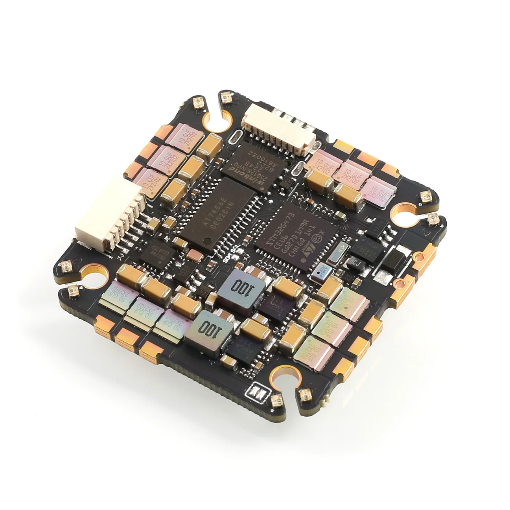
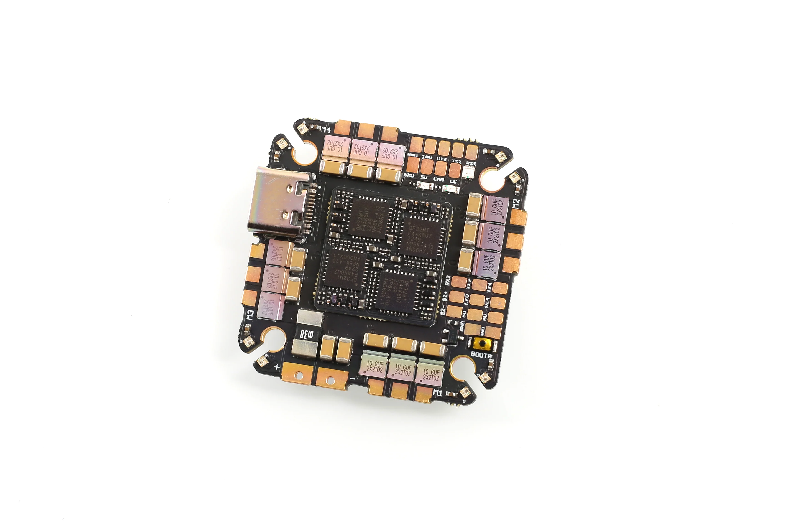
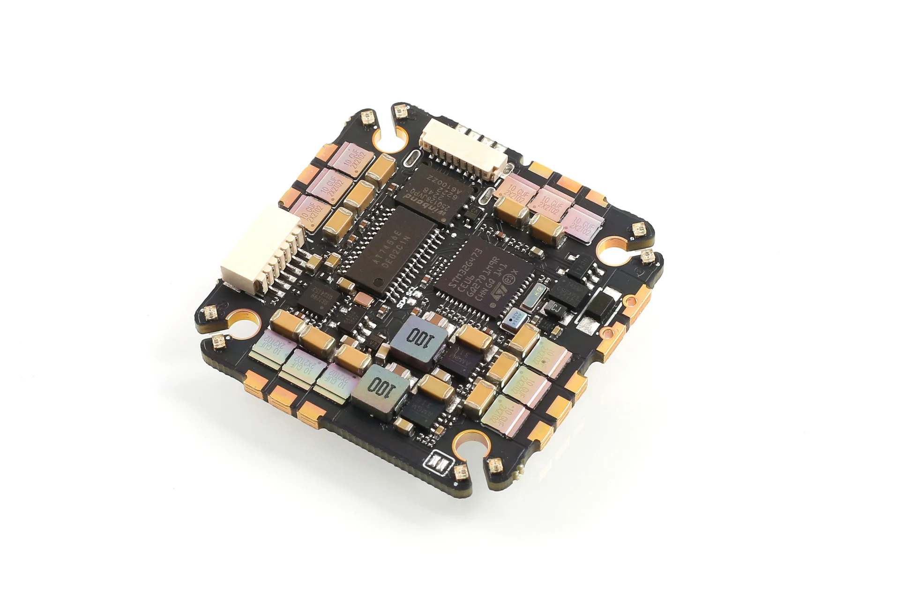

import Tabs from '@theme/Tabs'
import TabItem from '@theme/TabItem'
import SpecGrid from '@site/src/components/SpecGrid'

# Airbot Fenix G4 35A AIO

<Tabs>

<TabItem value="specifications" label="Specifications" default>

<SpecGrid>

</SpecGrid>

## Other Features

- SD Card Slot: None
- Onboard Receiver: No
- Hardware Inverter: Yes
- Bluetooth: No
- WiFi: No
- Onboard RGB LED: 16x

## ESC Specifications

- ESC MCU: QF32MTF4AK8U7
- ESC Firmware: AM32
- ESC Target: F4A_AIO_F421
- Continuous Current: 35A
- Burst Current: 45A

## Input/Output

- USB Connector: USB Type-C
- ESC Outputs: 4x
- UARTs: 4x
- I2C: Yes
- SWD: Yes
- SPI: No
- 3.3V Output: No
- 4.5V (VBUS) Output: Yes
- 5V Output: 2A
- 10V Output: 2A
- Current Sensor: Yes
- Analog RSSI Input: No
- LED Strip Output: Yes
- Buzzer Output: Yes

## Pads

### UARTs

| Name   | Label   | Notes                             |
| ------ | ------- | --------------------------------- |
| UART 1 | TX1/RX1 | VTX                               |
| UART 2 | RX2/TX2 | Optional inverter for SBUS/F.Port |
| UART 4 | TX4/RX4 |                                   |

### Power

| Name            | Label | Count | Notes |
| --------------- | ----- | ----- | ----- |
| 5V              | 5V    | 3x    |       |
| 10V             | 10V   | 1x    |       |
| Battery Voltage | VBAT  | 1x    |       |

### Analog Video

| Name           | Label | Notes |
| -------------- | ----- | ----- |
| Video In       | CAM   |       |
| Camera Control | CC    |       |
| Video Out      | VTX   |       |

### Buzzer

| Name     | Label | Notes |
| -------- | ----- | ----- |
| Buzzer + | BZ+   |       |
| Buzzer - | BZ-   |       |

### RGB LEDs

| Name | Label  | Count | Notes                              |
| ---- | ------ | ----- | ---------------------------------- |
| LED  | LED    | 1x    |                                    |
|      | LED_EN | 1x    | Bridge pads to enable onboard LEDs |

### USB Breakout

| Name      | Label | Notes |
| --------- | ----- | ----- |
| Ground    | GND   |       |
| USB Power | VBUS  |       |
| Data -    | DN    |       |
| Data +    | DP    |       |

### I2C

| Name  | Label | Notes                                 |
| ----- | ----- | ------------------------------------- |
| Clock | SCL   | Small pads in the middle of the board |
| Data  | SDA   |                                       |

## Connectors

### Digital VTX

| Pin | Name     | Label |
| --- | -------- | ----- |
| 1   | 10V      | 10V   |
| 2   | Ground   | GND   |
| 3   | UART1 TX | TX1   |
| 4   | UART1 RX | RX1   |
| 5   | Ground   | GND   |
| 6   | SBUS     | TX2   |

</TabItem>

<TabItem value="wiring" label="Wiring Diagrams">

[AIRBOTG4AIO Diagram](./AIRBOTG4AIO-images/AIRBOTG4AIO-diagram.pdf)

</TabItem>

<TabItem value="photos" label="Photos">

</TabItem>

<TabItem value="notes" label="Notes">

:::info

**VTX Connector**

The AIO features a multi-purpose connector for both digital and analog VTXs:

- When both GND pins in the connector are used, the TX2 pin will be used as an inverted RX pin for SBUS, the connector will function like a regular digital VTX connector following the standard pinout
- When only the first GND pin is used, the TX2 pin will instead output analog video, the connector can be used with analog VTXs

:::

**Onboard LEDs**

The flight controller has 28 RGB LEDs onboard, connected in parallel to the LED signal connection, and powered from the onboard regulator. Bridging the LED_EN pads will connect the signal line to the LEDs, enabling full control of the LEDs from the flight controller.

</TabItem>
	
</Tabs>
