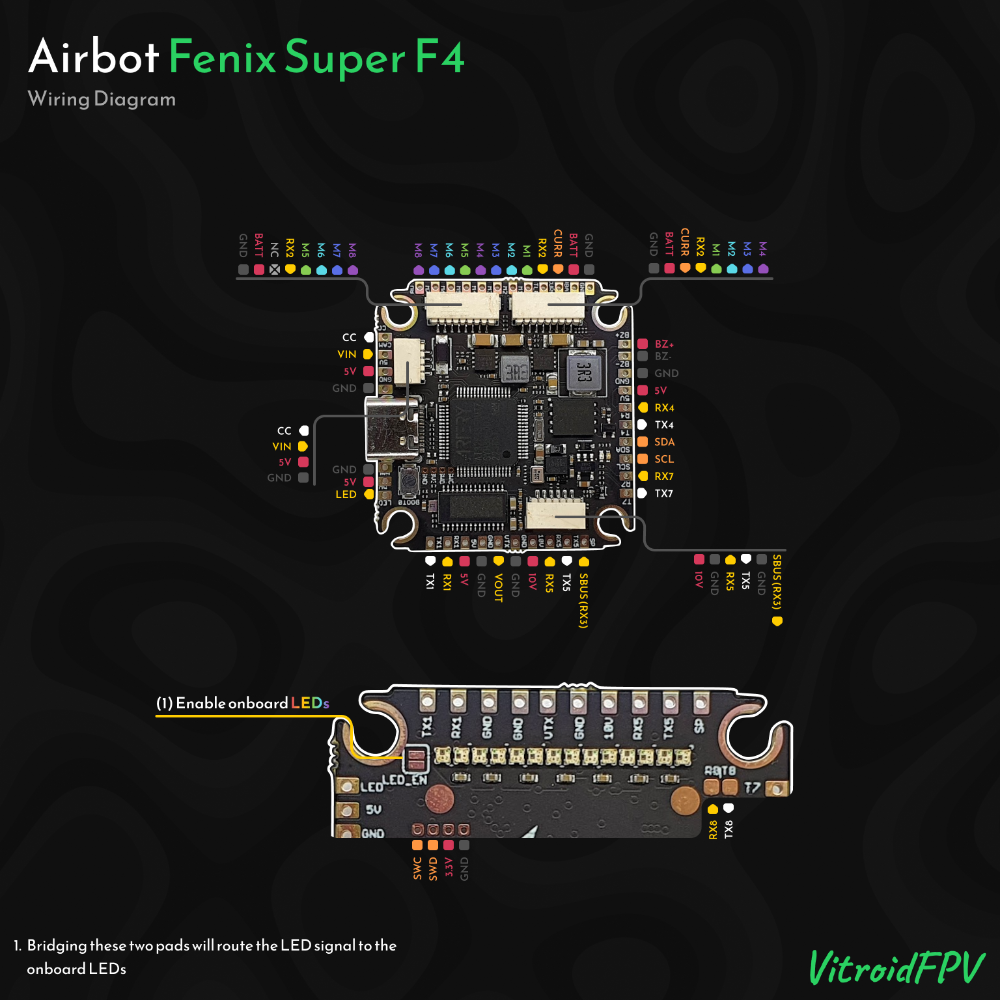

import Tabs from '@theme/Tabs'
import TabItem from '@theme/TabItem'
import SpecGrid from '@site/src/components/SpecGrid'

# Airbot Fenix Super F4

<Tabs>

<TabItem value="specifications" label="Specifications" default>

<SpecGrid>

</SpecGrid>

## Other Features

- SD Card Slot: None
- Onboard Receiver: No
- Hardware Inverter: Yes
- Bluetooth: No
- WiFi: No
- Onboard RGB LED: 28x

## Input/Output

- USB Connector: USB Type-C
- Motor Outputs: 8x
- UARTs: 8x
- I2C: Yes
- SWD: Yes
- SPI: No (present on developer versions)
- 3.3V Output: Yes
- 4.5V (VBUS) Output: Yes
- 5V Output: 3A
- 10V Output: 3A
- Current Sensor: Yes
- Analog RSSI Input: No
- LED Strip Output: Yes
- Buzzer Output: Yes

## Pads

### UARTs

| Name   | Label   | Notes                          |
| ------ | ------- | ------------------------------ |
| UART 1 | TX1/RX1 |                                |
| UART 2 | RX2     | ESC Telemetry                  |
| UART 3 | TX3/RX3 | Inverted - SBUS/F.Port         |
| UART 4 | TX4/RX4 |                                |
| UART 5 | TX5/RX5 |                                |
| UART 7 | TX7/RX7 |                                |
| UART 8 | TX8/RX8 | Smaller pads on the other side |

### Power

| Name            | Label | Count | Notes         |
| --------------- | ----- | ----- | ------------- |
| 3.3V            |       | 1x    | In SWD pinout |
| 5V              | 5V    | 3x    |               |
| 10V             | 10V   | 1x    |               |
| Battery Voltage | VBAT  | 1x    |               |

### ESC Signal

| Name     | Label | Notes |
| -------- | ----- | ----- |
| Current  | CURR  |       |
| Signal 1 | M1    |       |
| Signal 2 | M2    |       |
| Signal 3 | M3    |       |
| Signal 4 | M4    |       |
| Signal 5 | M5    |       |
| Signal 6 | M6    |       |
| Signal 7 | M7    |       |
| Signal 8 | M8    |       |

### Analog Video

| Name           | Label | Notes |
| -------------- | ----- | ----- |
| Video In       | CAM   |       |
| Camera Control | CC    |       |
| Video Out      | VTX   |       |

### Buzzer

| Name     | Label | Notes |
| -------- | ----- | ----- |
| Buzzer + | BZ+   |       |
| Buzzer - | BZ-   |       |

### RGB LEDs

| Name | Label  | Count | Notes                              |
| ---- | ------ | ----- | ---------------------------------- |
| LED  | LED    | 1x    |                                    |
|      | LED_EN | 1x    | Bridge pads to enable onboard LEDs |

### USB Breakout

| Name      | Label | Notes |
| --------- | ----- | ----- |
| Ground    | GND   |       |
| USB Power | VBUS  |       |
| Data -    | DN    |       |
| Data +    | DP    |       |

### I2C

| Name  | Label | Notes |
| ----- | ----- | ----- |
| Clock | SCL   |       |
| Data  | SDA   |       |

### SWD

| Name   | Label | Notes |
| ------ | ----- | ----- |
| SWC    |       |       |
| SWD    |       |       |
| 3.3V   |       |       |
| Ground |       |       |

## Connectors

### ESC 1-4

| Pin | Name            | Label |
| --- | --------------- | ----- |
| 1   | Ground          | GND   |
| 2   | Battery Voltage | VBAT  |
| 3   | Current         | CURR  |
| 4   | Telemetry       | RX2   |
| 5   | Signal 1        | M1    |
| 6   | Signal 2        | M2    |
| 7   | Signal 3        | M3    |
| 8   | Signal 4        | M4    |

### ESC 5-8

| Pin | Name            | Label |
| --- | --------------- | ----- |
| 1   | Ground          | GND   |
| 2   | Battery Voltage | VBAT  |
| 3   | Telemetry       | RX2   |
| 4   | Signal 5        | M5    |
| 5   | Signal 6        | M6    |
| 6   | Signal 7        | M7    |
| 7   | Signal 8        | M8    |

### Camera

| Pin | Name           | Label |
| --- | -------------- | ----- |
| 1   | Ground         | GND   |
| 2   | 5V             | 5V    |
| 3   | Video In       | CAM   |
| 4   | Camera Control | CC    |

### Digital VTX

| Pin | Name     | Label |
| --- | -------- | ----- |
| 1   | 10V      | 10V   |
| 2   | Ground   | GND   |
| 3   | UART5 TX | TX5   |
| 4   | UART5 RX | RX5   |
| 5   | Ground   | GND   |
| 6   | SBUS     | RX3   |

</TabItem>

<TabItem value="wiring" label="Wiring Diagrams">

</TabItem>

<TabItem value="photos" label="Photos">

</TabItem>

<TabItem value="notes" label="Notes">

:::caution

**AT32F435 MCU**

The AT32F435 MCUs are only supported in Betaflight versions 4.5 and newer. Older versions of Betaflight do not have a target for it, and do not work on this platform.

:::

**Onboard LEDs**

The flight controller has 28 RGB LEDs onboard, connected in parallel to the LED signal connection, and powered from the onboard regulator. Bridging the LED_EN pads will connect the signal line to the LEDs, enabling full control of the LEDs from the flight controller.

</TabItem>
	
</Tabs>
