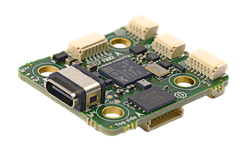
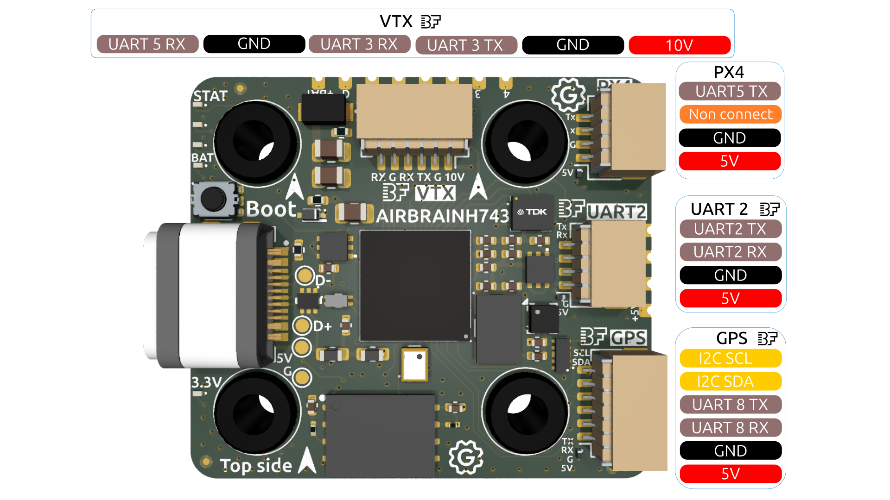
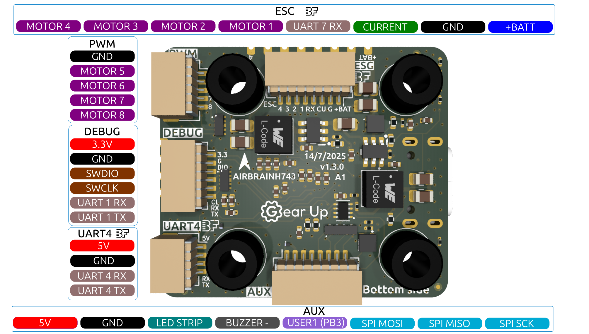
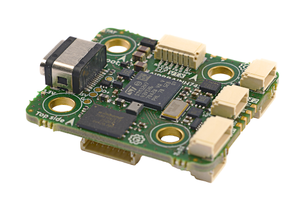
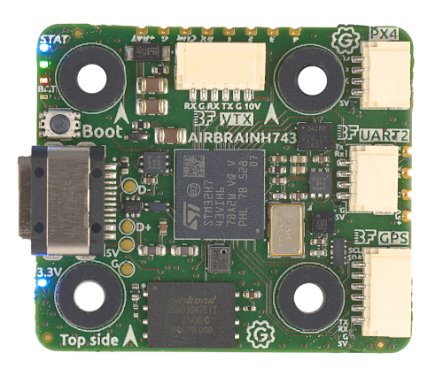
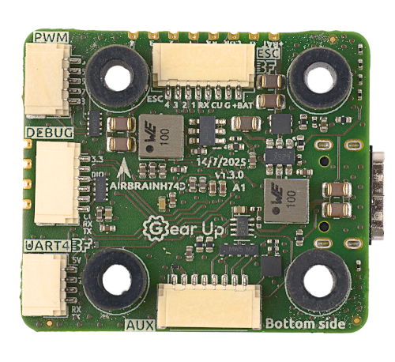

import Tabs from '@theme/Tabs'
import TabItem from '@theme/TabItem'
import SpecGrid from '@site/src/components/SpecGrid'

# Gear Up AirBrain H743

<Tabs>

<TabItem value="specifications" label="Specifications" default>

<SpecGrid>

</SpecGrid>

## Other Features

{/* List the remaining available features, if a specific feature is not present, write "No" */}
{/* The format and order of the list should stay the same */}

- 3-10s LiPo support
- Magnetometer (Compass): LIS2MDL
- Hardware Inverter: Yes
- Onboard RGB LED:
  Betaflight controlled LEDs, 1x Red, 1x Green, 1x Blue
- 2 x Power LED
- Built in voltage monitoring
- Made in Europe 🇪🇺
- SD Card Slot: No
- Onboard Receiver: No
- Bluetooth: No
- WiFi: No

## Information

:::info

[Gear Up Documentation](https://takeyourgear.com/pages/products/airbrain)

:::

:::info

[Buy in Europe](https://droneshop.nl/gearup-airbrain-h743-fc)
:::

:::info

[Buy International](https://www.rotorama.de/product/AirBrain-H743)

:::

:::info

Gear Up AirBrain H743 is made in Europe and NDAA compliant

:::

## Input/Output

{/* List the available connections accessible from pads or connectors, if a specific connection is not present, write "No" */}

- USB Connector:
  USB Type-C
- Motor Outputs:
  8x
- UARTs:
  7
- I2C:
  Yes
- SWD:
  Yes
- SPI:
  Yes
- 3.3V Output:
  Yes, MAX 0.5A
- 5V (VBUS) Output:
  Yes, when powered from USB, only UART2 connector gets 5V
- 5V Output:
  Yes, MAX 2A
- 10V Output:
  Yes, MAX 2.5A
- Current Sensor:
  Yes
- Analog RSSI Input:
  No
- LED Strip Output:
  Yes
- Buzzer Output:
  Yes

## Connectors

### ESC (Motor 1-4)

The pin configuration for the JST SH connector is as follows:

| Pin # | Name               | Label | Notes                |
| :---- | :----------------- | :---- | :------------------- |
| 1     | V+ (VBAT)          | +BAT  | Power input (10-42V) |
| 2     | GND                | G     | Ground               |
| 3     | Current            | CU    | Current (PC5)        |
| 4     | UART 7 (Telemetry) | RX    | UART 7 RX            |
| 5     | Signal 1           | 1     | Motor 1              |
| 6     | Signal 2           | 2     | Motor 2              |
| 7     | Signal 3           | 3     | Motor 3              |
| 8     | Signal 4           | 4     | Motor 4              |

### UARTs

#### UART 2

The pin configuration for the 4-pin JST SH connector is as follows:

| Pin # | Name      | Label | Notes        |
| :---- | :-------- | :---- | :----------- |
| 1     | V+ (5V)   | 5V    | Power output |
| 2     | GND       | G     | Ground       |
| 3     | UART 2 RX | RX    | UART 2 RX    |
| 4     | UART 2 TX | TX    | UART 2 TX    |

The '5V' from UART2 connector is also powered when connected via USB.
All other 5V outputs only work when powered trough battery.

#### UART 4

The pin configuration for the 4-pin JST SH connector is as follows:

| Pin # | Name      | Label | Notes        |
| :---- | :-------- | :---- | :----------- |
| 1     | V+ (5V)   | 5V    | Power output |
| 2     | GND       | G     | Ground       |
| 3     | UART 4 RX | RX    | UART 4 RX    |
| 4     | UART 4 TX | TX    | UART 4 TX    |

### Video Transmitter

The current pin configuration for the JST SH connector is as follows:

| Pin # | Name      | Label | Notes        |
| :---- | :-------- | :---- | :----------- |
| 1     | V+ (10V)  | 10V   | Power output |
| 2     | GND       | G     | Ground       |
| 3     | UART 3 TX | TX    | UART 3 TX    |
| 4     | UART 3 RX | RX    | UART 3 RX    |
| 5     | GND       | G     | Ground       |
| 6     | UART 5 RX | RX    | UART 5 RX    |

### GPS

The pin configuration for the 6-pin JST SH connector is as follows:

| Pin # | Name      | Label | Notes        |
| :---- | :-------- | :---- | :----------- |
| 1     | V+ (5V)   | 5V    | Power output |
| 2     | GND       | G     | Ground       |
| 3     | UART 8 RX | RX    | UART 8 RX    |
| 4     | UART 8 TX | TX    | UART 8 TX    |
| 5     | I2C SDA   | SDA   | I2C SDA      |
| 6     | I2C SCL   | SCL   | I2C SCL      |

### Motor 5 - 8

The current pin configuration for the JST SH connector is as follows:

| Pin # | Name     | Label | Notes   |
| :---- | :------- | :---- | :------ |
| 1     | GND      | G     | Ground  |
| 2     | Signal 5 | 5     | Motor 5 |
| 3     | Signal 6 | 6     | Motor 6 |
| 4     | Signal 7 | 7     | Motor 7 |
| 5     | Signal 8 | 8     | Motor 8 |

### Auxiliary

The current pin configuration for the JST SH connector is as follows:

| Pin # | Name      | Label | Notes                   |
| :---- | :-------- | :---- | :---------------------- |
| 1     | V+ (5V)   | 5V    | Power output            |
| 2     | GND       | G     | Ground                  |
| 3     | LED STRIP |       | LED STRIP               |
| 4     | BUZZER -  |       | BUZZER - (Buzzer minus) |
| 5     | USER1     |       | USER1 (PB3)             |
| 6     | SPI MOSI  |       | SPI MOSI (PE6)          |
| 7     | SPI MISO  |       | SPI MISO (PE5)          |
| 8     | SPI SCK   |       | SPI SCK (PE12)          |

### Debug

The current pin configuration for the JST SH connector is as follows:

| Pin # | Name      | Label | Notes                                       |
| :---- | :-------- | :---- | :------------------------------------------ |
| 1     | V+ (3.3V) | 3.3   | Power output                                |
| 2     | GND       | G     | Ground                                      |
| 3     | SWDIO     | DIO   | SWDIO                                       |
| 4     | SWCLK     | CLK   | SWCLK                                       |
| 5     | UART 1 RX | RX    | UART 1 RX (do not use for other then debug) |
| 6     | UART 1 TX | TX    | UART 1 TX (do not use for other then debug) |

### PX 4

The current pin configuration for the JST SH connector is as follows:

| Pin # | Name        | Label | Notes        |
| :---- | :---------- | :---- | :----------- |
| 1     | V+ (5V)     | 5V    | Power output |
| 2     | GND         | G     | Ground       |
| 3     | Non connect | NC    | Non connect  |
| 4     | UART 5 TX   | TX    | UART 5 TX    |

## Pads

### ESC

There are pads in parallel with the ESC JST SH connector

| Pin # | Name               | Label | Notes                |
| :---- | :----------------- | :---- | :------------------- |
| 1     | V+ (VBAT)          | +BAT  | Power input (10-42V) |
| 2     | GND                | G     | Ground               |
| 3     | Current            | CU    | Current (PC5)        |
| 4     | UART 7 (Telemetry) | RX    | UART 7 RX            |
| 5     | Signal 1           | 1     | Motor 1              |
| 6     | Signal 2           | 2     | Motor 2              |
| 7     | Signal 3           | 3     | Motor 3              |
| 8     | Signal 4           | 4     | Motor 4              |

### UART 2

There are pads in parallel with the JST SH connector for UART2

| Pin # | Name      | Label | Notes        |
| :---- | :-------- | :---- | :----------- |
| 1     | V+ (5V)   | 5V    | Power output |
| 2     | GND       | G     | Ground       |
| 3     | UART 2 RX | RX    | UART 2 RX    |
| 4     | UART 2 TX | TX    | UART 2 TX    |

</TabItem>

<TabItem value="wiring" label="Wiring Diagrams">

</TabItem>

<TabItem value="photos" label="Photos">

</TabItem>

<TabItem value="datasheet" label="Datasheet">

:::info

[Gear Up AirBrain H743 Datasheet](https://raw.githubusercontent.com/GearUp-Company/AirBrainH743/main/datasheet/Datasheet_AirBrain.pdf)

:::

</TabItem>
	<TabItem value="buy" label="Buy">
:::info

[Buy in Europe](https://droneshop.nl/gearup-airbrain-h743-fc)
:::

:::info

[Buy International](https://www.rotorama.de/product/AirBrain-H743)

:::

</TabItem>

</Tabs>
