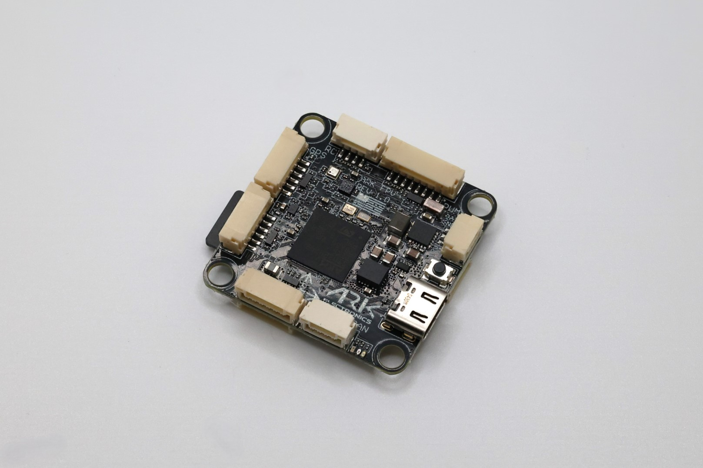
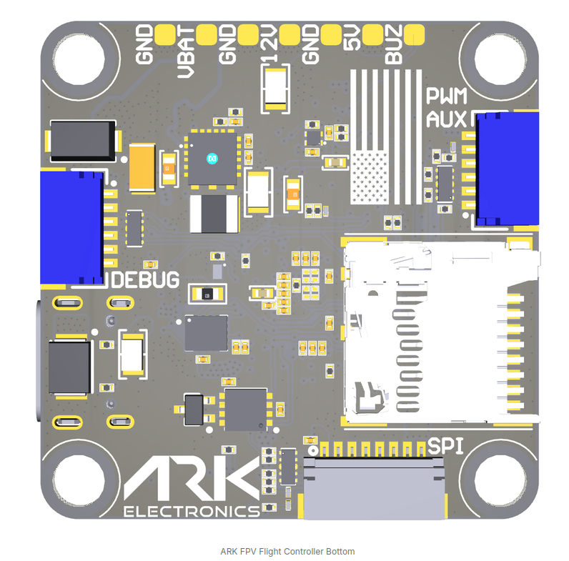
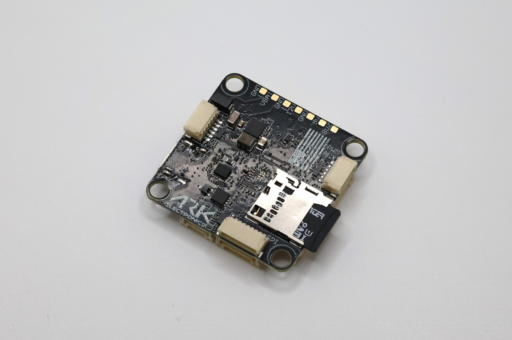

import Tabs from '@theme/Tabs'
import TabItem from '@theme/TabItem'
import SpecGrid from '@site/src/components/SpecGrid'

# ARK FPV Flight Controller

<Tabs>

<TabItem value="specifications" label="Specifications" default>

<SpecGrid>

</SpecGrid>

## Other Features

- SD Card Slot: Yes
- Onboard Receiver: No
- Hardware Inverter: No
- Bluetooth: No
- WiFi: No
- Onboard RGB LED: Yes

## Information

:::info

[ARK FPV Website](https://docs.arkelectron.com/flight-controller/ark-fpv)

:::

:::info

[ARK FPV Store](https://arkelectron.com/product/ark-fpv-flight-controller/)

:::

:::info

ARK FPV is USA built and NDAA compliant

:::

## Input/Output

- USB Connector:
  USB Type-C
- Motor Outputs:
  8x
- UARTs:
  7x
- I2C:
  Yes
- SWD:
  Yes
- SPI:
  Yes
- 3.3V Output:
  Yes
- 4.5V (VBUS) Output:
  No
- 5V Output:
  2A
- 12V Output:
  2A
- Current Sensor:
  Yes
- Analog RSSI Input:
  No
- LED Strip Output:
  Yes
- Buzzer Output:
  Yes

## Connectors

### UARTs

| Name    | Label  | Notes                             |
| ------- | ------ | --------------------------------- |
| SERIAL0 | USB    |                                   |
| SERIAL1 | UART7  | DisplayPort HD VTX                |
| SERIAL2 | UART5  | ESC Telemetry                     |
| SERIAL3 | USART1 | GPS1                              |
| SERIAL4 | USART2 | User, SBUS pin on HD VTX, RX only |
| SERIAL5 | UART4  | ESC Telem, RX only                |
| SERIAL6 | USART6 | RC Input                          |
| SERIAL7 | OTG2   | SLCAN                             |

### PWM UART4 - 8 Pin JST-GH

| Pin Number | Signal Name  | Voltage  |
| ---------- | ------------ | -------- |
| 1          | VBAT IN      | 5.5V–54V |
| 2          | CURR_IN_EXT  | 3.3V     |
| 3          | UART4_RX_EXT | 3.3V     |
| 4          | FMU_CH1_EXT  | 3.3V     |
| 5          | FMU_CH2_EXT  | 3.3V     |
| 6          | FMU_CH3_EXT  | 3.3V     |
| 7          | FMU_CH4_EXT  | 3.3V     |
| 8          | GND          | GND      |

### RC - 4 Pin JST-GH

| Pin Number | Signal Name          | Voltage |
| ---------- | -------------------- | ------- |
| 1          | 5.0V                 | 5.0V    |
| 2          | USART6_RX_IN_EXT     | 3.3V    |
| 3          | USART6_TX_OUTPUT_EXT | 3.3V    |
| 4          | GND                  | GND     |

### PWM EXTRA - 6 Pin JST-SH

| Pin Number | Signal Name | Voltage |
| ---------- | ----------- | ------- |
| 1          | FMU_CH5_EXT | 3.3V    |
| 2          | FMU_CH6_EXT | 3.3V    |
| 3          | FMU_CH7_EXT | 3.3V    |
| 4          | FMU_CH8_EXT | 3.3V    |
| 5          | FMU_CH9_EXT | 3.3V    |
| 6          | GND         | GND     |

### POWER AUX - 3 Pin JST-GH

| Pin Number | Signal Name | Voltage  |
| ---------- | ----------- | -------- |
| 1          | 12.0V       | 12.0V    |
| 2          | GND         | GND      |
| 3          | VBAT IN/OUT | 5.5V-54V |

### CAN - 4 Pin JST-GH

| Pin Number | Signal Name | Voltage |
| ---------- | ----------- | ------- |
| 1          | 5.0V        | 5.0V    |
| 2          | CAN1_P      | 5.0V    |
| 3          | CAN1_N      | 5.0V    |
| 4          | GND         | GND     |

### GPS - 6 Pin JST-GH

| Pin Number | Signal Name        | Voltage |
| ---------- | ------------------ | ------- |
| 1          | 5.0V               | 5.0V    |
| 2          | USART1_TX_GPS1_EXT | 3.3V    |
| 3          | USART1_RX_GPS1_EXT | 3.3V    |
| 4          | I2C1_SCL_GPS1_EXT  | 3.3V    |
| 5          | I2C1_SDA_GPS1_EXT  | 3.3V    |
| 6          | GND                | GND     |

### TELEM - 6 Pin JST-GH

| Pin Number | Signal Name          | Voltage |
| ---------- | -------------------- | ------- |
| 1          | 5.0V                 | 5.0V    |
| 2          | UART7_TX_TELEM1_EXT  | 3.3V    |
| 3          | UART7_RX_TELEM1_EXT  | 3.3V    |
| 4          | UART7_CTS_TELEM1_EXT | 3.3V    |
| 5          | UART7_RTS_TELEM1_EXT | 3.3V    |
| 6          | GND                  | GND     |

### VTX - 6 Pin JST-GH

| Pin Number | Signal Name          | Voltage |
| ---------- | -------------------- | ------- |
| 1          | 12.0V                | 12.0V   |
| 2          | GND                  | GND     |
| 3          | UART5_TX_TELEM2_EXT  | 3.3V    |
| 4          | UART5_RX_TELEM2_EXT  | 3.3V    |
| 5          | USART2_RX_TELEM3_EXT | 3.3V    |
| 6          | GND                  | GND     |

### SPI (OSD or IMU) - 8 Pin JST-SH

| Pin Number | Signal Name     | Voltage |
| ---------- | --------------- | ------- |
| 1          | 5.0V            | 5.0V    |
| 2          | SPI6_SCK_EXT    | 3.3V    |
| 3          | SPI6_MISO_EXT   | 3.3V    |
| 4          | SPI6_MOSI_EXT   | 3.3V    |
| 5          | SPI6_nCS1_EXT   | 3.3V    |
| 6          | SPI6_DRDY1_EXT  | 3.3V    |
| 7          | SPI6_nRESET_EXT | 3.3V    |
| 8          | GND             | GND     |

### Flight Controller Debug - 6 Pin JST-SH

| Pin Number | Signal Name     | Voltage |
| ---------- | --------------- | ------- |
| 1          | 3V3_FMU         | 3.3V    |
| 2          | USART3_TX_DEBUG | 3.3V    |
| 3          | USART3_RX_DEBUG | 3.3V    |
| 4          | FMU_SWDIO       | 3.3V    |
| 5          | FMU_SWCLK       | 3.3V    |
| 6          | GND             | GND     |

</TabItem>

<TabItem value="connectors" label="Connectors">

</TabItem>

<TabItem value="photos" label="Photos">

</TabItem>

</Tabs>
