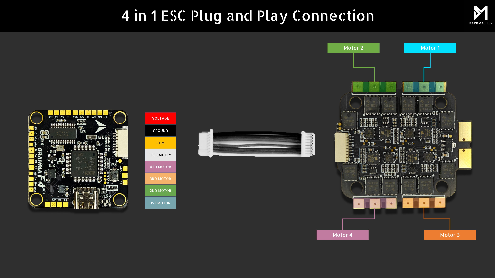
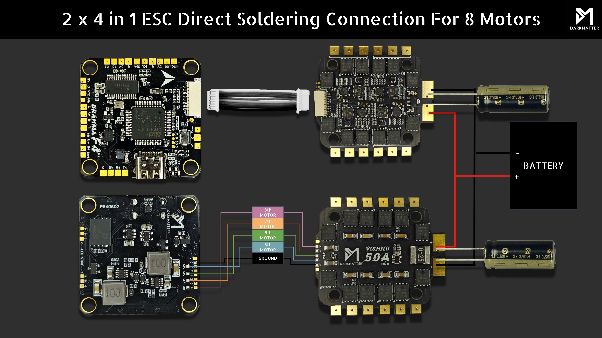

import Tabs from '@theme/Tabs'
import TabItem from '@theme/TabItem'
import SpecGrid from '@site/src/components/SpecGrid'

# Darkmatter Brahma F4 MK II

<Tabs>

<TabItem value="specifications" label="Specifications" default>

<SpecGrid>

</SpecGrid>

## Other Features

- SD Card Slot: No
- Onboard Receiver: No
- Hardware Inverter: Yes
- Bluetooth: No
- WiFi: No
- Onboard RGB LED: No

## Input/Output

- USB Connector: USB C
- Motor Outputs: 8x
- UARTs: 4x
- I2C: Yes
- SWD: Yes
- SPI: Yes
- 3.3V Output: Yes
- 4.5V (VBUS) Output: No
- 5V Output: 2A
- 9V Output: 2A
- Current Sensor: No
- Analog RSSI Input: Yes
- LED Strip Output: Yes
- Buzzer Output: Yes

## Pads

### UARTs

| Name   | Label   | Notes         |
| ------ | ------- | ------------- |
| UART 1 | TX1/RX1 | SBUS          |
| UART 2 | RX2     |               |
| UART 3 | RX3     | ESC Telemetry |
| UART 4 | TX4/RX4 |               |

### Power

| Name            | Label | Count | Notes         |
| --------------- | ----- | ----- | ------------- |
| 3.3V            |       | 1x    | In SWD pinout |
| 5V              | 5V    | 5x    |               |
| 9V              | 9V    | 1x    |               |
| Battery Voltage | VBAT  | 1x    |               |

### ESC Signal

| Name      | Label | Notes |
| --------- | ----- | ----- |
| VBAT+     | V     |       |
| Ground    | G     |       |
| Current   | C     |       |
| Telemetry | T     |       |
| Signal 1  | 1     |       |
| Signal 2  | 2     |       |
| Signal 3  | 3     |       |
| Signal 4  | 4     |       |
| Signal 5  | M5    |       |
| Signal 6  | M6    |       |
| Signal 7  | M7    |       |
| Signal 8  | M8    |       |

## Connectors

### ESC 1-4

| Pin | Name            | Label |
| --- | --------------- | ----- |
| 1   | Battery Voltage | V     |
| 2   | Ground          | G     |
| 3   | Current         | C     |
| 4   | Telemetry       | T     |
| 5   | Signal 1        | M1    |
| 6   | Signal 2        | M2    |
| 7   | Signal 3        | M3    |
| 8   | Signal 4        | M4    |

</TabItem>

<TabItem value="wiring" label="Wiring Diagrams">

</TabItem>

<TabItem value="photos" label="Photos">

</TabItem>

<TabItem value="notes" label="Notes">

:::danger

When using individual ESCs with integrated BECs, please do not connect the 5V OUT of the ESC to the FC, it will cause the FC/ESC to burn.

:::

</TabItem>
	
</Tabs>
