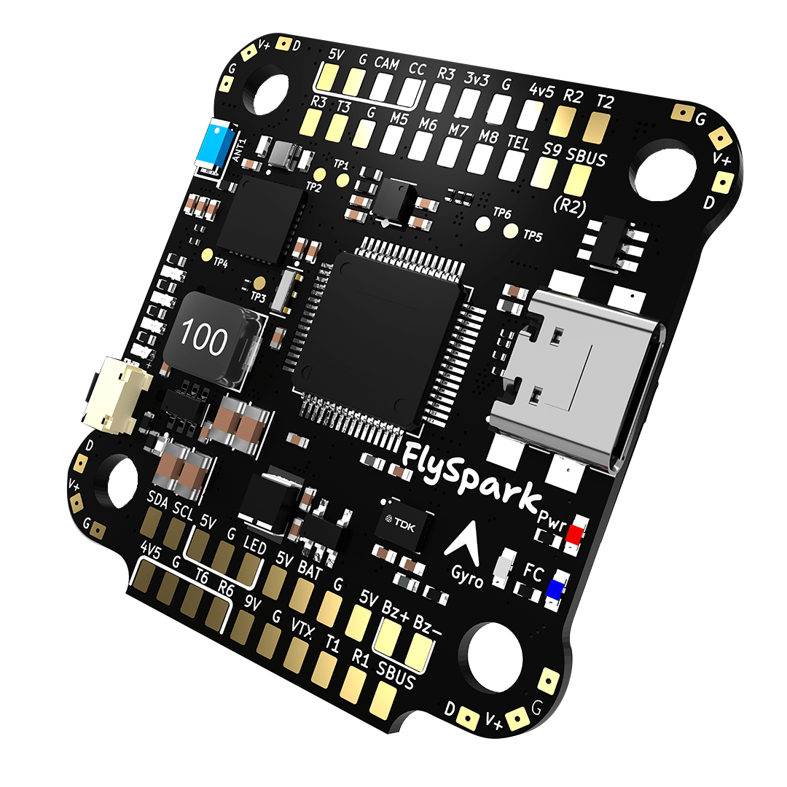
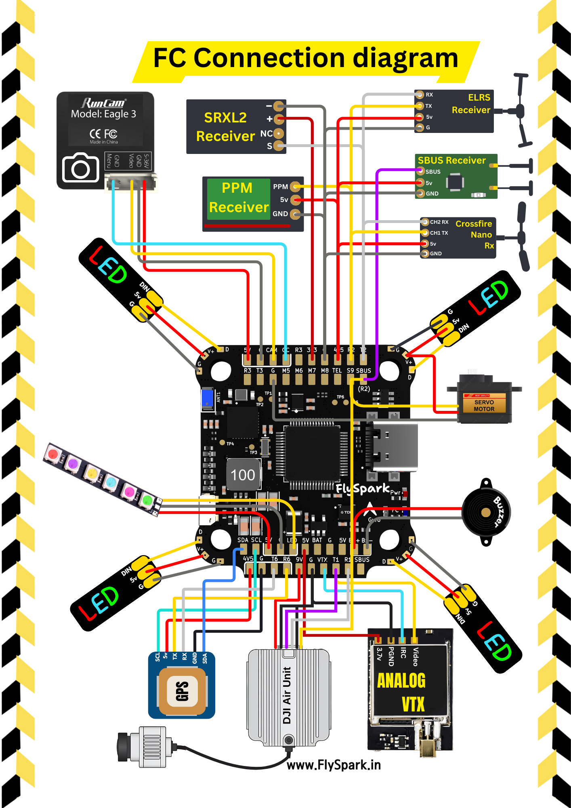
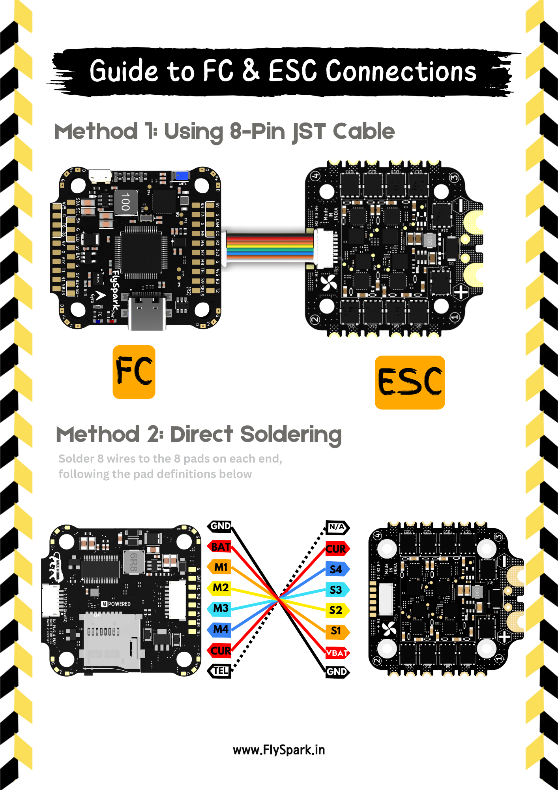
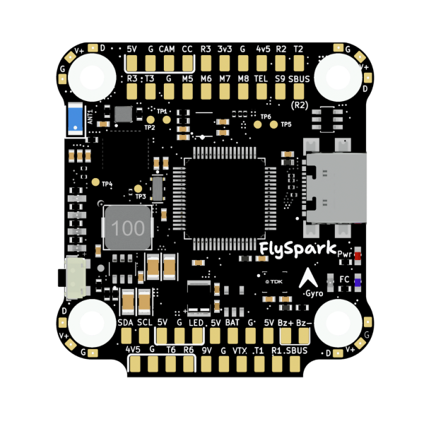

import Tabs from '@theme/Tabs'
import TabItem from '@theme/TabItem'
import SpecGrid from '@site/src/components/SpecGrid'

# FlySpark F4 V1

<Tabs>

<TabItem value="specifications" label="Specifications" default>

<SpecGrid>

</SpecGrid>

## Other Features

- SD Card Slot: Yes
- Onboard Receiver: No
- Hardware Inverter: Yes
- Bluetooth: Yes
- WiFi: No
- Onboard RGB LED: No

## Input/Output

- USB Connector: USB C
- Motor Outputs: 8x
- UARTs: 4x
- I2C: Yes
- SWD: Yes (SWD - TP5, SWC - TP6)
- SPI: No
- 3.3V Output: Yes
- 4.5V (VBUS) Output: Yes
- 5V Output: 3A
- 9V Output: 3A
- Current Sensor: Yes
- Analog RSSI Input: Yes
- LED Strip Output: Yes
- Buzzer Output: Yes

## Pads

### UARTs

| Name   | Label | Notes         |
| ------ | ----- | ------------- |
| UART 1 | T1/R1 |               |
| UART 2 | T2/R2 | SBUS          |
| UART 3 | T3/R3 |               |
| UART 5 | TEL   | ESC Telemetry |
| UART 6 | T6/R6 |               |

### Power

| Name            | Label | Count | Notes |
| --------------- | ----- | ----- | ----- |
| 3.3V            |       | 1x    |       |
| 5V              | 5V    | 8x    |       |
| 9V              | 9V    | 1x    |       |
| Battery Voltage | BAT   | 1x    |       |

### ESC Signal

| Name            | Label | Notes |
| --------------- | ----- | ----- |
| Battery Voltage | BAT   |       |
| Ground          | GND   |       |
| Telemetry       | TEL   |       |
| Signal 1        | M1    |       |
| Signal 2        | M2    |       |
| Signal 3        | M3    |       |
| Signal 4        | M4    |       |
| Signal 5        | M5    |       |
| Signal 6        | M6    |       |
| Signal 7        | M7    |       |
| Signal 8        | M8    |       |

## Connectors

### ESC 1-4

| Pin | Name            | Label |
| --- | --------------- | ----- |
| 1   | Telemetry       |       |
| 2   | Current         |       |
| 5   | Signal 4        |       |
| 6   | Signal 3        |       |
| 7   | Signal 2        |       |
| 8   | Signal 1        |       |
| 3   | Battery Voltage |       |
| 4   | GND             |       |

### Digital VTX

| Pin | Name     | Label |
| --- | -------- | ----- |
| 1   | 9V       |       |
| 2   | Ground   |       |
| 3   | UART1 TX |       |
| 4   | UART1 RX |       |
| 5   | Ground   |       |
| 6   | SBUS     |       |

</TabItem>

<TabItem value="wiring" label="Wiring Diagrams">

</TabItem>

<TabItem value="photos" label="Photos">

</TabItem>

<TabItem value="notes" label="Notes">

:::info

Bluetooth is available for wireless configuration via the FlySpark app

:::

</TabItem>
	
</Tabs>
