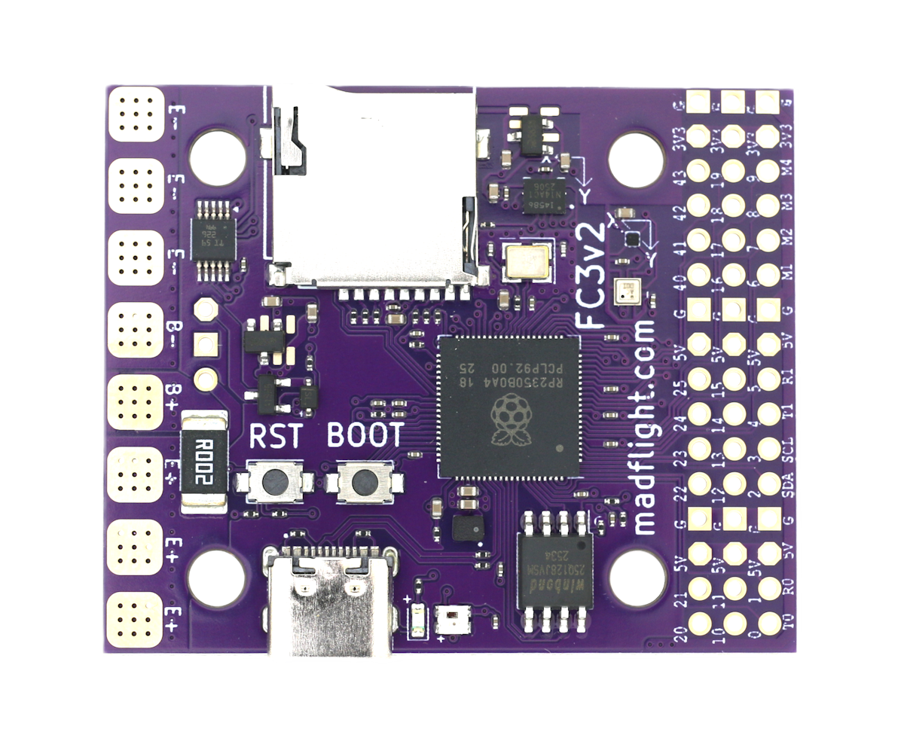
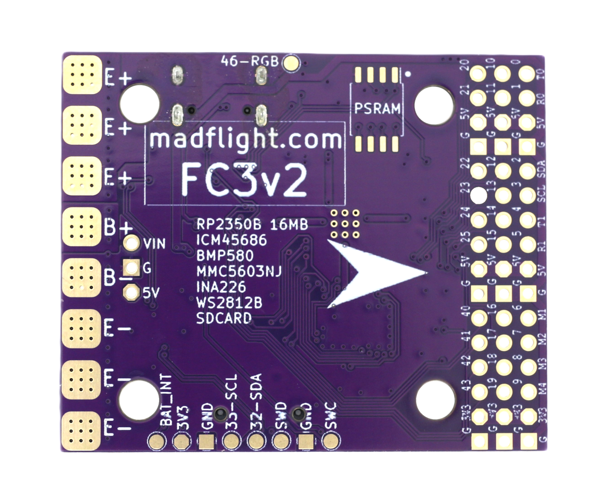

import Tabs from '@theme/Tabs'
import TabItem from '@theme/TabItem'
import SpecGrid from '@site/src/components/SpecGrid'

# Madflight FC3 RP2350B

<Tabs>

<TabItem value="specifications" label="Specifications" default>

<SpecGrid>

</SpecGrid>

## Other Features

{/* List the remaining available features, if a specific feature is not present, write "No" */}
{/* The format and order of the list should stay the same */}

- SD Card Slot: Yes
- Onboard Receiver: No
- Hardware Inverter: No
- Bluetooth: No
- WiFi: No
- Onboard RGB LED: Yes

## Information

:::info

[madflight FC3 Documentation](https://madflight.com/Board-FC3-BF/)

:::

:::info

[madflight FC3 Store](https://www.tindie.com/products/madflight/flight-controller-raspberry-pi-rp2350b/)

:::

## Input/Output

{/* List the available connections accessible from pads or connectors, if a specific connection is not present, write "No" */}

- USB Connector: USB C
- Motor Outputs: 8x
- UARTs: 4x (2x hardware, 2x PIO)
- I2C: Yes
- SWD: Yes
- SPI: Yes
- 3.3V Output: Yes
- 4.5V (VBUS) Output: No
- 5V Output: 2A
- 12V Output: No
- Current Sensor: Yes
- Analog RSSI Input: Yes
- LED Strip Output: Yes
- Buzzer Output: Yes

## Pads

### UARTs

| Name     | Notes                             |
| -------- | --------------------------------- |
| USB VCP  |                                   |
| UART0    | RC Input                          |
| UART1    | GPS                               |
| PIOUART0 | User, ESC Telem, VTX              |
| PIOUART1 | User, ESC Telem, VTX              |

## Connectors

### 2.54mm Pin Header - First Row

| Pin Number | GPIO | Signal Name |
| ---------- | ---- | ----------- |
| 1          | 0    | UART0_TX    |
| 2          | 1    | UART0_RX    |
| 3          | 5.0V |             |
| 4          | GND  |             |
| 5          | 2    | I2C1_SDA    |
| 6          | 3    | I2C1_SCL    |
| 7          | 4    | UART1_TX    |
| 8          | 5    | UART1_RX    |
| 9          | 5.0V |             |
| 10         | GND  |             |
| 11         | 6    | MOTOR1      |
| 12         | 7    | MOTOR2      |
| 13         | 8    | MOTOR3      |
| 14         | 9    | MOTOR4      |
| 15         | 3.3V |             |
| 16         | GND  |             |

### 2.54mm Pin Header - Second Row

| Pin Number | GPIO | Signal Name |
| ---------- | ---- | ----------- |
| 1          | 10   | PIOUART0_TX |
| 2          | 11   | PIOUART0_RX |
| 3          | 5.0V |             |
| 4          | GND  |             |
| 5          | 12   | LED1_PIN    |
| 6          | 13   | LED2_PIN    |
| 7          | 14   | PIOUART1_TX |
| 8          | 15   | PIOUART1_RX |
| 9          | 5.0V |             |
| 10         | GND  |             |
| 11         | 16   | MOTOR5      |
| 12         | 17   | MOTOR6      |
| 13         | 18   | MOTOR7      |
| 14         | 19   | MOTOR8      |
| 15         | 3.3V |             |
| 16         | GND  |             |

### 2.54mm Pin Header - Third Row

| Pin Number | GPIO | Signal Name |
| ---------- | ---- | ----------- |
| 1          | 20   | unused      |
| 2          | 21   | unused      |
| 3          | 5.0V |             |
| 4          | GND  |             |
| 5          | 22   | PINIO1_PIN  |
| 6          | 23   | PINIO2_PIN  |
| 7          | 24   | PINIO3_PIN  |
| 8          | 25   | PINIO4_PIN  |
| 9          | 5.0V |             |
| 10         | GND  |             |
| 11         | 40   | ADC_RSSI_PIN |
| 12         | 41   | ADC_CURR_PIN |
| 13         | 42   | ADC_EXTERNAL1_PIN |
| 14         | 43   | unused      |
| 15         | 3.3V |             |
| 16         | GND  |             |

</TabItem>

<TabItem value="photos" label="Photos">

</TabItem>

</Tabs>

