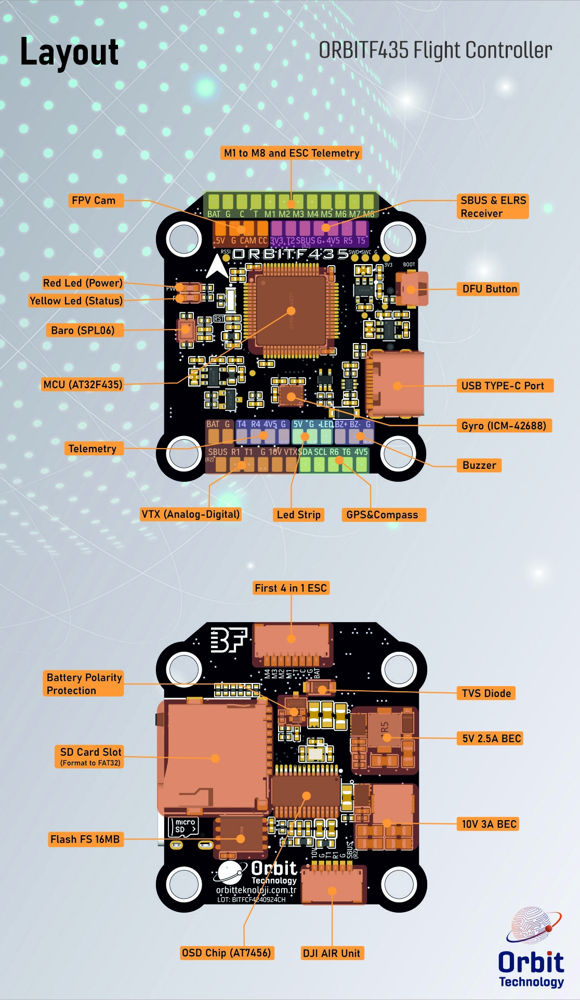

---
sidebar_custom_props:
  specs:
    target: ORBITF435
    mcu: AT32F435
    imu: ICM42688P
    osd: AT7456
    barometer: DPS310 or SPL06
    blackbox: 16MB and SD Card
    dimensions: 39x41mm
    mounting: M4 30.5x30.5mm
    weight: 8.8g
---

import Tabs from '@theme/Tabs'
import TabItem from '@theme/TabItem'
import SpecGrid from '@site/src/components/SpecGrid'

# ORBITF435

<Tabs>

<TabItem value="specifications" label="Specifications" default>

<SpecGrid>

</SpecGrid>

## Other Features

- SD Card Slot: Up to 4GB
- Hardware Inverter: Yes
- Power input: 2S - 6S LiPo (note: output will be lower than 10V when using 2S).
- Power output: 3.3V/500mA, 4.5V-5V/2.5A, 10V/3A
- RSSI input: RSSI input solder pad
- I2C: Used for external magnetometer (GPS module), Barometer module
- ESC: 8 pwm pins for motors
- Buzzer: Buz+ (5V) and Buz- pad used for 5V Buzzer

## Input/Output

- USB Connector: USB Type-C
- Motor Outputs: 8x
- UARTs: 6x
- I2C: Yes
- SWD: Yes
- SPI: No
- 3.3V Output: Yes
- 4.5V (VBUS) Output: Yes
- 5V Output: 2.5A
- 10V Output: 3A
- Current Sensor: No
- Analog RSSI Input: Yes
- LED Strip Output: Yes
- Buzzer Output: Yes

## Pads

### UARTs

| Name   | Label | Notes                 |
| ------ | ----- | --------------------- |
| UART 1 | T1/R1 | Digital VTX Telemetry |
| UART 2 | T2/R2 | Inverted - SBUS       |
| UART 3 | R3    | ESC Telemetry         |
| UART 4 | T4/R4 |                       |
| UART 5 | T5/R5 |                       |
| UART 6 | T6/R6 | GPS                   |

### RECEIVER (SBUS + ELRS)

| Name      | Label     | Notes                                         |
| --------- | --------- | --------------------------------------------- |
| SBUS      | SBUS (R2) | SBUS/F.port (serialrx_inverted should be OFF) |
| USART2_TX | T2        |                                               |
| USART2_RX | R2        |                                               |
| 4V5       | 4V5       |                                               |
| GND       | G         |                                               |
| 3V3       | 3V3       |                                               |
| RSSI      | RS        | Analog Channel for RSSI                       |

### Power

| Name    | Label | Count | Notes      |
| ------- | ----- | ----- | ---------- |
| 3.3V    | 3V3   | 1x    | 500mA max. |
| 4.5V    | 4V5   | 3x    | 2.5A max.  |
| 5V      | 5V    | 2x    | 2.5A max.  |
| 10V     | 10V   | 1x    | 3A max.    |
| Battery | BAT   | 2x    | 2-6S Input |

### ESC Signal

| Name      | Label | Notes         |
| --------- | ----- | ------------- |
| Battery   | BAT   | 2-6S Input    |
| GND       | G     |               |
| Current   | C     |               |
| USART3_RX | T     | ESC Telemetry |
| Signal 1  | M1    |               |
| Signal 2  | M2    |               |
| Signal 3  | M3    |               |
| Signal 4  | M4    |               |
| Signal 5  | M5    |               |
| Signal 6  | M6    |               |
| Signal 7  | M7    |               |
| Signal 8  | M8    |               |

### Analog Video

| Name           | Label | Notes          |
| -------------- | ----- | -------------- |
| Video In       | CAM   | Camere Input   |
| Camera Control | CC    | Camera Control |
| Video Out      | VTX   | OSD output     |

### Buzzer

| Name     | Label | Notes |
| -------- | ----- | ----- |
| Buzzer + | BZ+   |       |
| Buzzer - | BZ-   |       |

### LED Strip Output (WS2882)

| Name | Label | Count | Notes                       |
| ---- | ----- | ----- | --------------------------- |
| LED  | LED   | 1x    | Strip LED output for WS2882 |

### I2C

| Name  | Label | Notes |
| ----- | ----- | ----- |
| Clock | SCL   |       |
| Data  | SDA   |       |

### SWD

| Name | Label | Notes |
| ---- | ----- | ----- |
| SWC  | SWC   |       |
| SWD  | SWD   |       |
| GND  | G     |       |
| 3.3V | 3V3   |       |

## Connectors

### ESC 1-4 (JST-SH 8 pins)

| Pin | Name      | Label |
| --- | --------- | ----- |
| 1   | Battery   | BAT   |
| 2   | Ground    | G     |
| 3   | Current   | C     |
| 4   | Telemetry | T     |
| 5   | Signal 1  | M1    |
| 6   | Signal 2  | M2    |
| 7   | Signal 3  | M3    |
| 8   | Signal 4  | M4    |

### Digital VTX (JST-SH 6 pins)

| Pin | Name      | Label     |
| --- | --------- | --------- |
| 1   | 10V       | 10V       |
| 2   | GND       | G         |
| 3   | USART1_TX | T1        |
| 4   | USART2_RX | R1        |
| 5   | GND       | G         |
| 6   | SBUS      | SBUS (R2) |

</TabItem>
<TabItem value="wiring" label="Wiring Diagrams">

</TabItem>

<TabItem value="photos" label="Photos">
  
</TabItem>

<TabItem value="notes" label="Notes">

:::info

**SBUS Inverter**

The SBUS pad is connected to USART2_RX (R2) through an inverter circuit, which can be toggled ON or OFF via CLI commands in Betaflight. To use R2 as an SBUS receiver, ensure that `serialrx_inverted` is set to OFF:

> set serialrx_inverted=OFF

> save

:::

:::danger

When using individual ESCs with integrated BECs, please do not connect the 5V OUT of the ESC to the FC, it will cause the FC/ESC to burn.

:::

</TabItem>

</Tabs>
