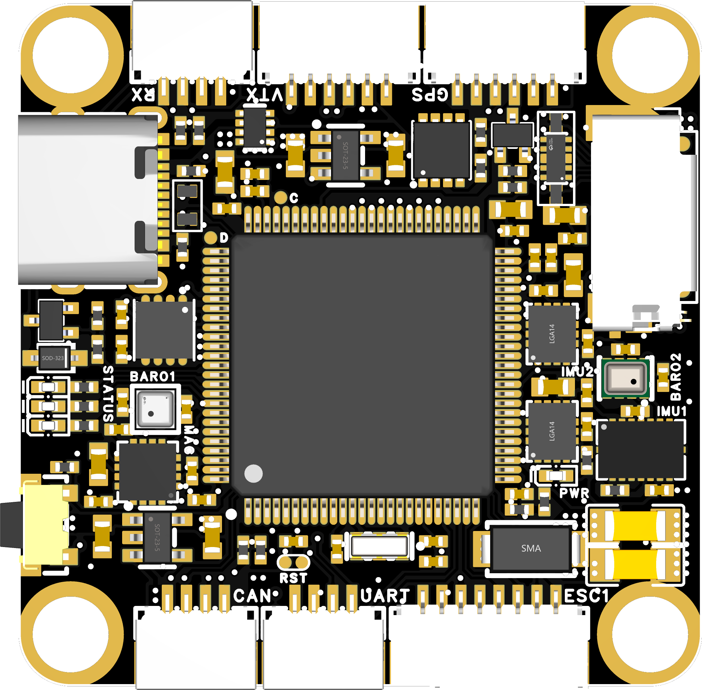
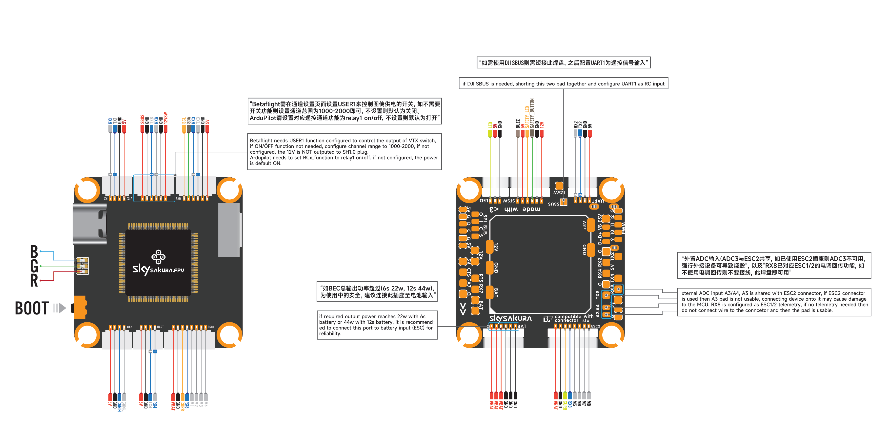
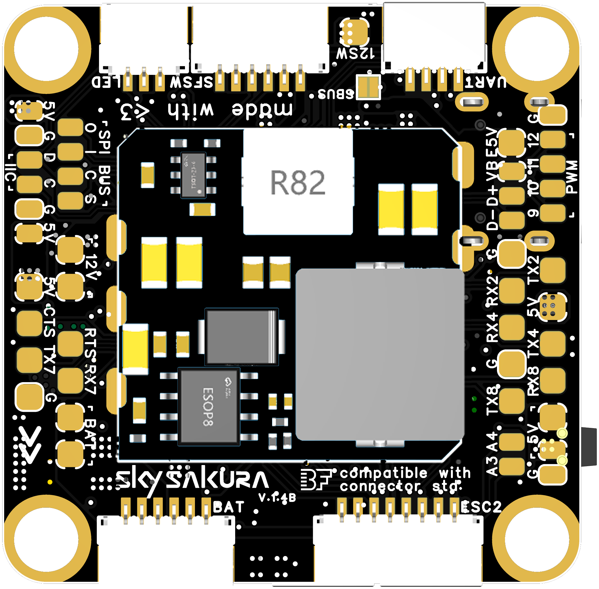
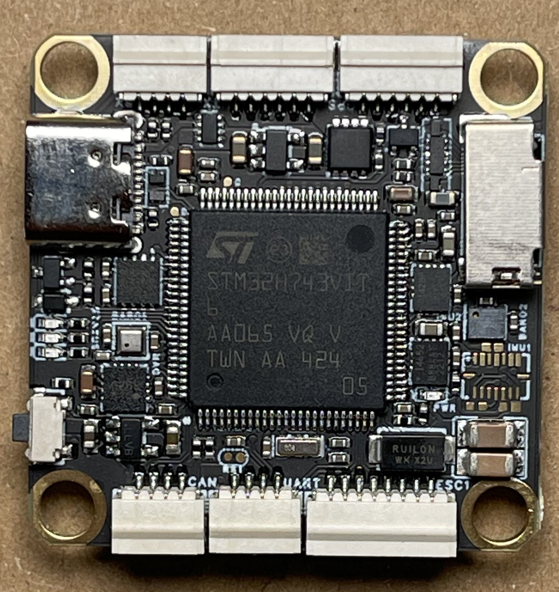
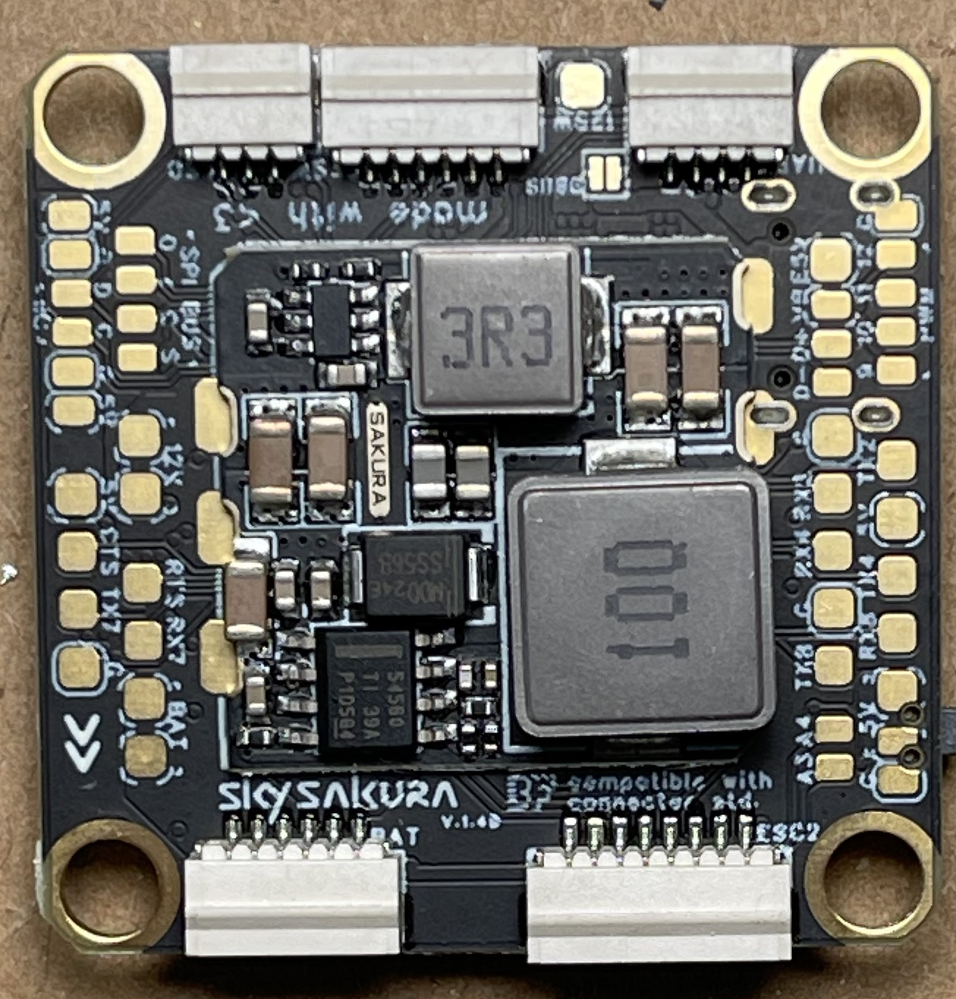
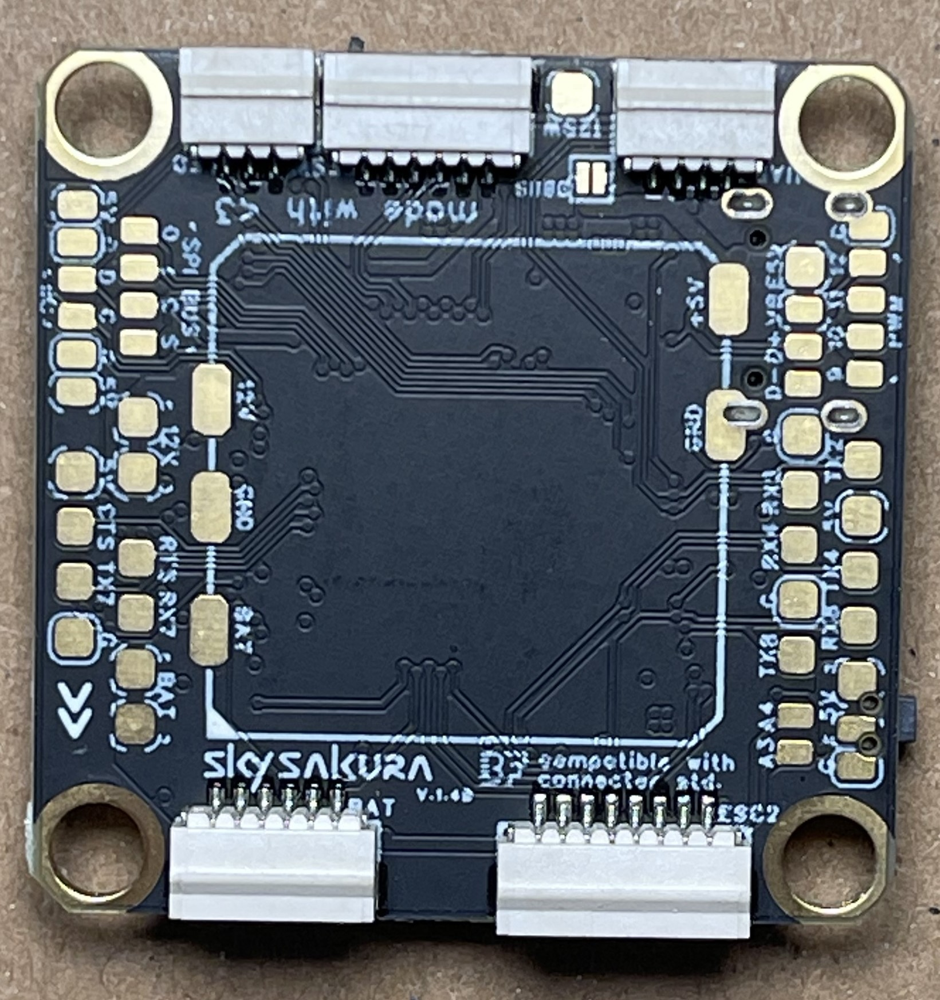
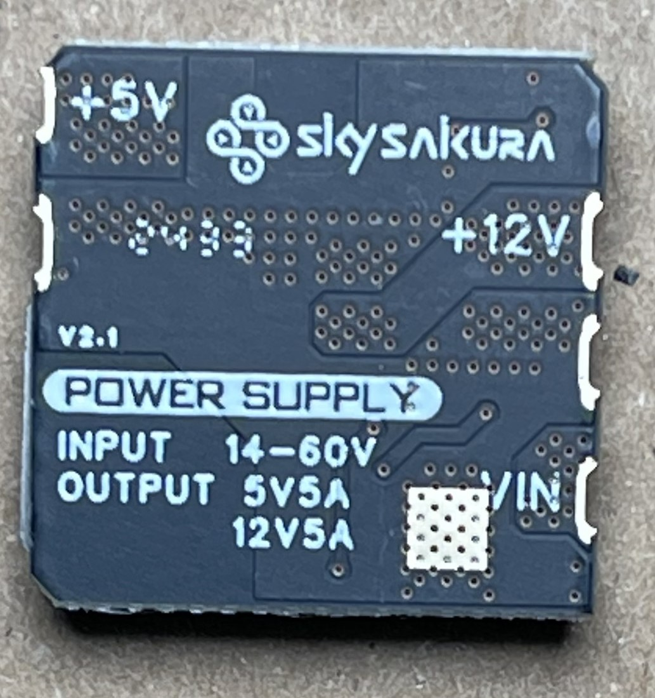
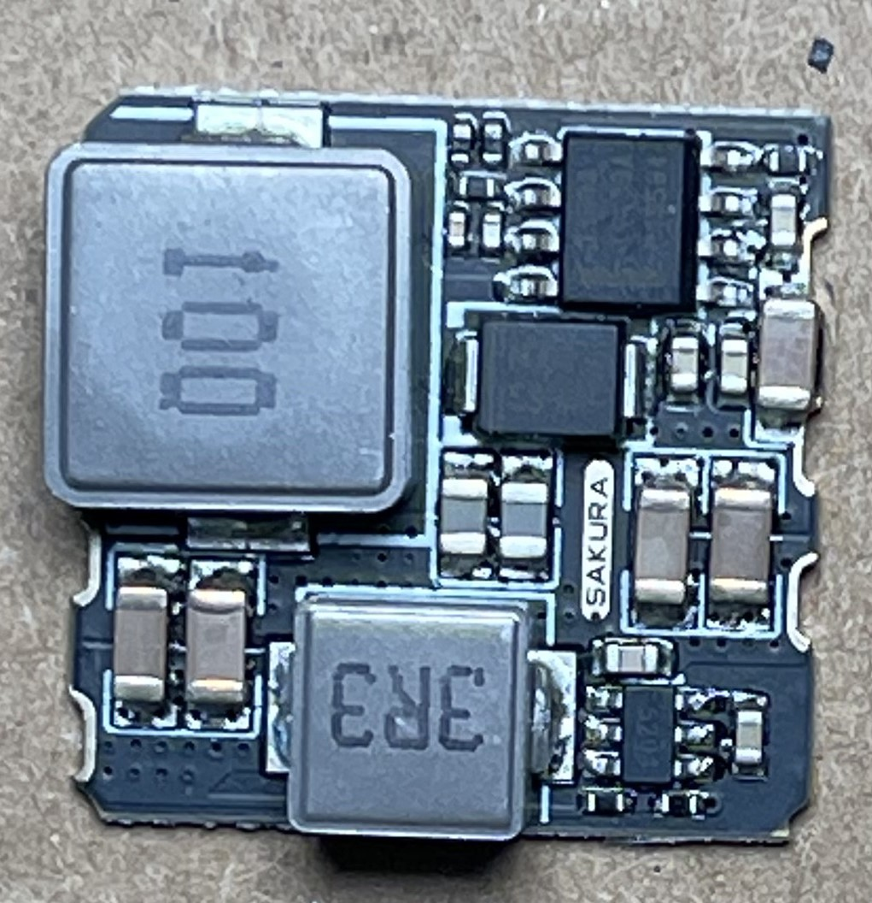

import Tabs from '@theme/Tabs'
import TabItem from '@theme/TabItem'
import SpecGrid from '@site/src/components/SpecGrid'

{/* IMPORTS NECESSARY FOR TAB FUNCTIONALITY, DO NOT REMOVE */}

{/* fill the specs list above with the relevant information, don't change any of the keys unless you know what you're doing. */}
{/* If a feature isn't present, just type "None". The target name should be the exact same as in the config repo, */}
{/* the MCU, IMU, OSD and Baro should be the part name if applicable */}

{/* Fill out documentation content below. Document everything that applies to the board */}
{/* Instructions, examples and mandatory values are commented out */}

# SKYSAKURA H743

<Tabs>

<TabItem value="specifications" label="Specifications" default>

<SpecGrid>

</SpecGrid>

## Other Features

{/* List the remaining available features, if a specific feature is not present, write "No" */}
{/* The format and order of the list should stay the same */}

- SD Card Slot: Yes
  {/* Yes/No */}
- Onboard Receiver: No
  {/* serial or SPI - SPI ELRS, Serial ELRS, etc... */}
- Hardware Inverter: No
  {/* hardware-level inversion for FrSky protocols - only applicable for MCUs without integrated inversion - only list Yes/No */}
- Bluetooth: No
  {/* Yes/No, if Yes, what interface - Yes (UART 1) */}
- WiFi: No
  {/* Yes/No, if Yes, what interface - Yes (UART 2) */}
- Onboard RGB LED: 3
  {/* Betaflight controlled LEDs, list total amount - 28x */}

## Input/Output

{/* List the available connections accessible from pads or connectors, if a specific connection is not present, write "No" */}

- USB Connector: USB C
  {/* USB C or USB Micro B (or JST connector/breakout pads) */}
- Motor Outputs: 12x
  {/* available amount - 4x, 6x, 8x, etc... */}
- UARTs: 7x
  {/* available amount - 4x, 6x, 8x, etc... */}
- I2C: Yes
  {/* Yes/No */}
- SWD: No
  {/* Yes/No */}
- SPI: Yes
  {/* Yes/No */}
- 3.3V Output: No
  {/* max current draw - 0.5A */}
- 4.5V (VBUS) Output: Yes
  {/* Yes/No */}
- 5V Output: 5A
  {/* max current draw - 3A */}
- 12V Output: 5A
  {/* max current draw - 3A */}
- Current Sensor: Yes
  {/* Yes/No */}
- Analog RSSI Input: Yes
  {/* Yes/No */}
- LED Strip Output: Yes
  {/* Yes/No */}
- Buzzer Output: Yes
  {/* Yes/No */}

## Pads

### UARTs

{/* Fill markdown tables, add any necessary notes */}

{/* Example: */}

| Name   | Label   | Notes       |
| ------ | ------- | ----------- |
| UART 1 | TX1/RX1 | MSP         |
| UART 2 | TX2/RX2 |             |
| UART 3 | TX3/RX3 | GPS         |
| UART 4 | TX4/RX4 | RX          |
| UART 6 | TX6/RX6 | DISPLAYPORT |
| UART 7 | TX7/RX7 |             |
| UART 8 | TX8/RX8 | ESC         |

### Power

{/* Example: */}

| Name            | Label | Count | Notes                                                                                                            |
| --------------- | ----- | ----- | ---------------------------------------------------------------------------------------------------------------- |
| VBAT5V          | 5V    | 3x    | Only available when battery power used, 1 in LED connector, 2 on pads                                            |
| 5V              | 5V    | 12x   |                                                                                                                  |
| 12V             | 12V   | 5x    | 2 regular output on pads, 1 switched output on pad, 1 switched output on pad, 1 regular output on SFSW connector |
| Battery Voltage | VBAT  | 2x    |                                                                                                                  |

{/* NOT MANDATORY, DOCUMENT EVERYTHING ELSE THAT IS AVAILABLE */}
{/* Example: */}

### ESC Signal

| Name      | Label | Notes |
| --------- | ----- | ----- |
| Current   | CURR  |       |
| Signal 1  | M1    |       |
| Signal 2  | M2    |       |
| Signal 3  | M3    |       |
| Signal 4  | M4    |       |
| Signal 5  | M5    |       |
| Signal 6  | M6    |       |
| Signal 7  | M7    |       |
| Signal 8  | M8    |       |
| Signal 9  | PWM9  |       |
| Signal 10 | PWM10 |       |
| Signal 11 | PWM11 |       |
| Signal 12 | PWM12 |       |

{/* ... */}

## Connectors

{/* HIGHLY VARIED, NOT MANDATORY, BUT EXAMPLES ARE PROVIDED */}

### ESC 1-4

| Pin | Name            | Label |
| --- | --------------- | ----- |
| 1   | Battery Voltage | VBAT  |
| 2   | Ground          | GND   |
| 3   | Current         | CURR  |
| 4   | Telemetry       | RX8   |
| 5   | Signal 1        | M1    |
| 6   | Signal 2        | M2    |
| 7   | Signal 3        | M3    |
| 8   | Signal 4        | M4    |

### ESC 5-8

| Pin | Name            | Label |
| --- | --------------- | ----- |
| 1   | Battery Voltage | VBAT  |
| 2   | Ground          | GND   |
| 3   | Current         | CURR  |
| 4   | Telemetry       | RX8   |
| 5   | Signal 5        | M5    |
| 6   | Signal 6        | M6    |
| 7   | Signal 7        | M7    |
| 8   | Signal 8        | M8    |

### UART

| Pin | Name   | Label |
| --- | ------ | ----- |
| 1   | 5V     | 5V    |
| 2   | Ground | GND   |
| 3   | TX     | TX    |
| 4   | RX     | RX    |

### GPS

| Pin | Name   | Label |
| --- | ------ | ----- |
| 1   | 5V     | 5V    |
| 2   | Ground | GND   |
| 3   | TX6    | TX6   |
| 4   | RX6    | RX6   |
| 5   | SDA    | SDA   |
| 6   | SCL    | SCL   |

### SFSW

| Pin | Name           | Label |
| --- | -------------- | ----- |
| 1   | 12V            | 12V   |
| 2   | Ground         | GND   |
| 3   | NOT USED IN BF | BUT   |
| 4   | NOT USED IN BF | LED   |
| 5   | 5V             | 5V    |
| 6   | BUZZ-          | BUZZ- |

### BATT

| Pin | Name            | Label |
| --- | --------------- | ----- |
| 1   | Battery Voltage | VBAT  |
| 2   | Battery Voltage | VBAT  |
| 3   | Battery Voltage | VBAT  |
| 4   | Ground          | GND   |
| 5   | Ground          | GND   |
| 6   | Ground          | GND   |

### CAN

| Pin | Name           | Label |
| --- | -------------- | ----- |
| 1   | 5V             | 5V    |
| 2   | GND            | GND   |
| 3   | NOT USED IN BF | CAN-H |
| 4   | NOT USED IN BF | CAN-L |

{/* ... */}

</TabItem>

<TabItem value="wiring" label="Wiring Diagrams">

{/* images should be located at the same directory level in a folder named "TARGETNAME-images" */}

{/* if the document is not made by the manufacturer, user-made media is allowed */}

</TabItem>

<TabItem value="photos" label="Photos">

{/* images should be located at the same directory level in a folder named "TARGETNAME-images" */}

{/* if the document is not made by the manufacturer, user-made media is allowed */}

</TabItem>

<TabItem value="notes" label="Notes">

{/* Add any relevant information, important notes for the hardware and software requrements, etc... */}

:::info

**DJI SBUS support**

SBUS is supported on VTX connector for DJI air unit.
Bridge SBUS pad then use UART4 as serial receiver.

:::

:::caution

12V and 5V bec maximum allowed output is 60W total. Operation above 22w(6s) or 44w(12s) requires BATT connection.

:::

{/* Regular notes can be written as regular text. */}

</TabItem>
	
</Tabs>
