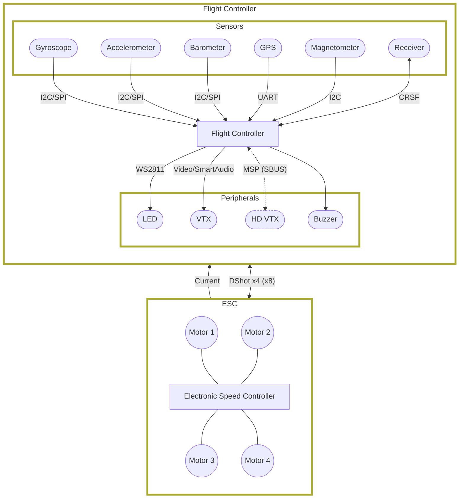
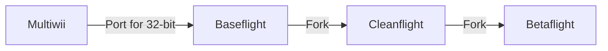

Betaflight is flight controller software (firmware) for multi-rotor and fixed wing craft.

If you're flying an FPV quadcopter, you're probably running Betaflight on the flight controller. A flight controller is basically a computer that reads the sensors (gyro, accelerometer, GPS, etc...), computes the desired actions to take, sends the commands to the ESC to control the motors, generate thrust, and keep the quadcopter in the air. It can also control other peripherals (VTX control, radio link telemetry, LEDs).

Betaflight is the software that runs on the flight controller to do all of this

## A bit about Betaflight's history...

Starting with a bit of a history lesson, the first flight controller software was called Multiwii. It ran on 8-bit microcontrollers, like an arduino, and as the name suggests, using a gyro board from the Nintendo Wii controllers. It was a great start, but was limited by the 8-bit microcontroller.

The next step was to move to more powerful microcontrollers, and the flight controller software to do this was called Baseflight, which was a port of Multiwii to 32-bit microcontrollers.

Due to some disagreements, the Baseflight project was forked into Cleanflight. Cleanflight was a norm for a pretty good while.

For even further experimentation, Betaflight was forked from Cleanflight as a way to have more cutting edge features in a separate firmware option (thus the name). You also see a lot of the support section having Cleanflight mentioned, but we're working on getting everything up to date. Betaflight has since overtaken Cleanflight in popularity, and is now the most popular flight controller software out there, with a lot of features and very active development.

## Betaflight Features

Betaflight is constantly being updated with new features and improvements. Its main focus is on high-performance flight (freestyle/racing quadcopters), but it also supports other types of aircraft (fixed wing, tri/hex/octocopters, and more). Recently, the focus has been expanding to support more advanced GPS rescue capabilities.

- **Wide Target Support** - Betaflight has become the de-facto standard for flight controllers, nearly every flight controller out there has a Betaflight target.
- **Receiver Protocol Support** - Betaflight supports a wide variety of receiver protocols, including CRSF, Ghost, FPort, SBUS, Spektrum, and more.
- **ESC Protocol Support** - Betaflight supports a wide variety of ESC protocols. The main one used on nearly everything is DShot, but there are also other protocols like Oneshot, Multishot, and even PWM if you really need them.
- **Precision Tuning** - Whether you're tuning a tinywhoop, a 5" quad, or a 7"+ macro, you can tune your craft to get the best performance out of it. With tune and filter presets, you can get a good starting point within seconds.
- **RGB LEDs** - Using any standard WS2811 LED strip, you can add a pop of color to your quad. You can even use the LEDs to display flight information, like battery level warnings, flight mode, status for troubleshooting, and more.
- **Wide Sensor Variety** - Betaflight can take advantage of a wide variety of sensors. The gyroscope is used for most basic flight control with acro mode, but you can also use an accelerometer for self-leveling, a magnetometer for global heading, a barometer for altitude measurement, and a GPS for GPS rescue and info.
- **OSD** - Betaflight supports on-screen display for pretty much any video system, be it analog or digital. You can display pretty much any information you want, from battery voltage and current draw, to GPS coordinates, speed, flight timers, artificial horizons, and more. You can also use the OSD to configure some settings and check post-flight statistics.
