# The Betaflight blackbox explorer curves MinMax control manual

The MinMax control PR can control curves scale and placement quickly and full.
The current MinMax curves settings are showed at 'Configure graphs' dialog box in the "Minimum" and "Maximum" columns.
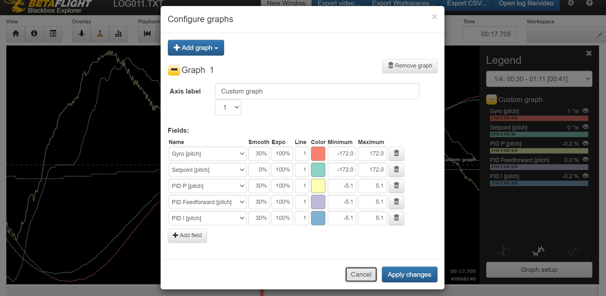
The MinMax values can be changed:

- By direct input into table cells at 'Configure graphs' dialog box. It is possible to changes values manualy or set default values by double mouse click at values field.
- By using context menu

To show context menu you must do right mouse click on Minimum or Maximum values field what you want to edit.
The main context menu:
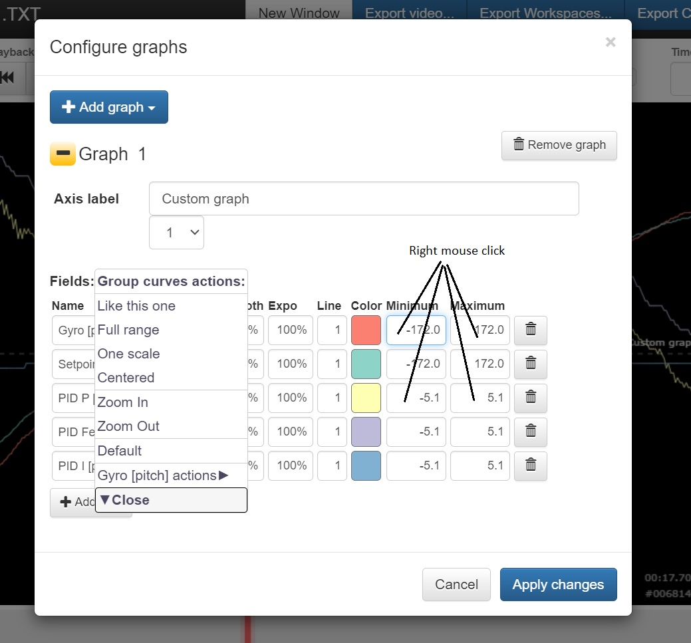

The main menu include following parts:

1. The menu actions to edit all curves
2. The menu actions to edit one curves what you selected by right mouse click (The 'Gyro pitch' for example at the picture)

The actions for all curves:

- 'Like this one' - apply MinMax of curve what you selected by right mouse click ('Gyro pitch' for example) to all curves.
- 'All to default' - set all curves MinMax values to default
- 'Zoom in', 'Zoom out' - change zoom for all curves
- 'Default' - set the all curves MinMax values to default
- 'Full range' - set the all curves MinMax values from Log file data during the all flight time
- 'One scale' - set all curves to one scale
- 'Centered' - The curves are centered around X-axis

The single curve submenu has same actions:
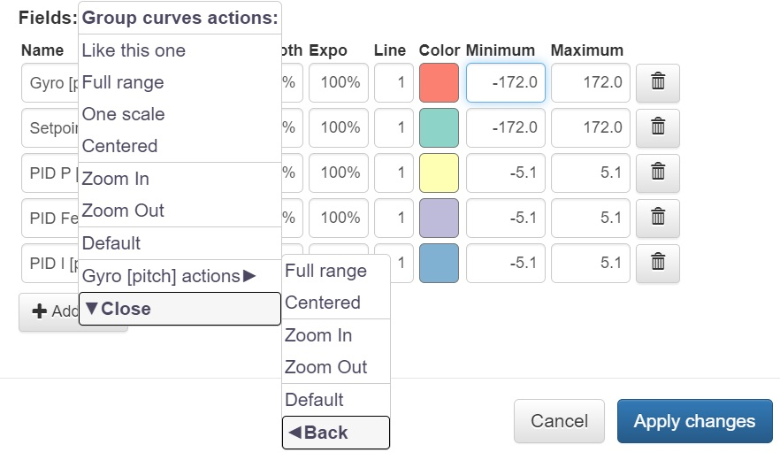

The main menu has extended mode. You need press the 'Shift' key to activate it and select the submenu, what you need.
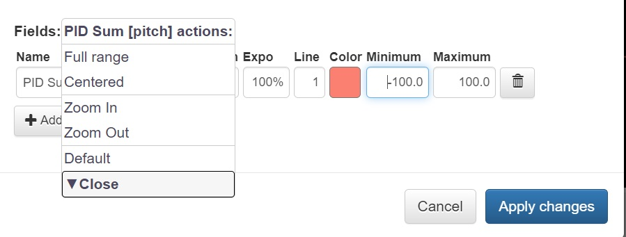

The 'Like this one' extended submenu.
You can change MinMax values and select curves what you need by using the checkboxes to apply these values.
Click 'SET MIN-MAX VALUES' item for apply.
Click 'Back' menu item to go back to main menu.
Click 'Apply change' or 'Cancel' button on the main 'Configure graphs' dialog box to close the menu and dialog box immediately
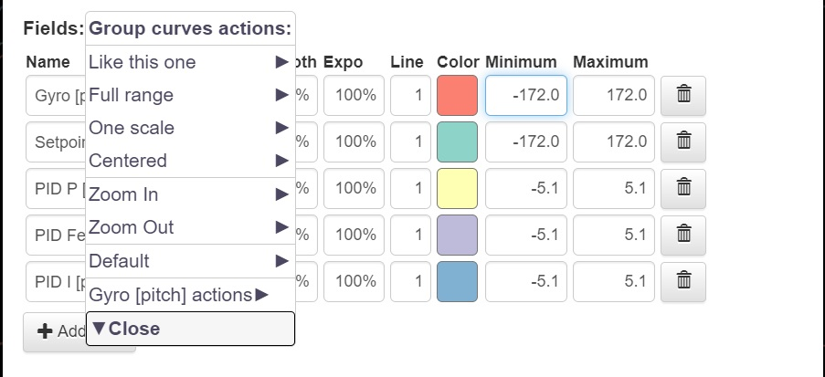

The 'Zoom in', 'Zoom out' extended submenu.
You can set the zoom procent value and select curves what you need by using the checkboxes to apply zoom.
Click 'ZOOM IN', 'ZOOM OUT' items for apply zoom
Click 'Back' menu item to go back to main menu.
Click 'Apply change' or 'Cancel' button on the main 'Configure graphs' dialog box to close the menu and dialog box immediately
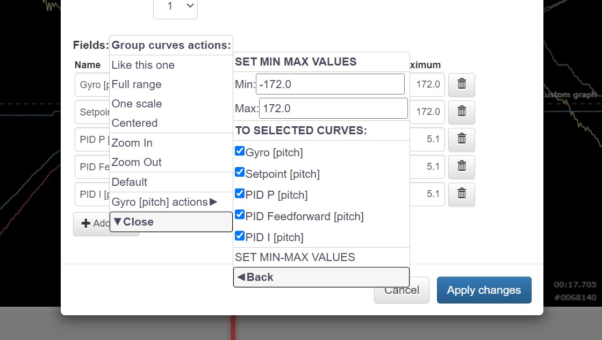

The 'Default' extended submenu.
You can select curves what you need by using the checkboxes to apply default values.
Click 'SET CURVES TO DEFAULT' item for apply
Click 'Back' menu item to go back to main menu.
Click 'Apply change' or 'Cancel' button on the main 'Configure graphs' dialog box to close the menu and dialog box immediately

The 'Full range' extended submenu.
You can select curves what you need by using the checkboxes to apply values.
Click 'At all global log time' menu item to set MinMax values from log data during all time.
Click 'At local window time' menu item to set MinMax values from current time interval at the chart window.
Click 'At markere time range' menu item to set MinMax values from markered time interval what you select by using "I", "O" keys. If it is not select then will apply all log time interval.
Click 'Back' menu item to go back to main menu.
Click 'Apply change' or 'Cancel' button on the main 'Configure graphs' dialog box to close the menu and dialog box immediately
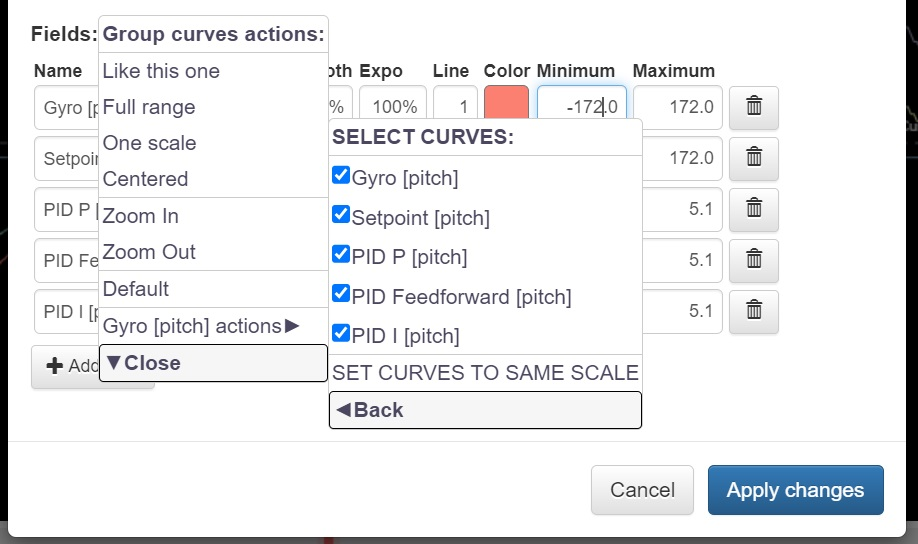

The 'One scale' extended submenu.
You can select curves what you need by using the checkboxes to set the same scale.
Click 'SET SET CURVES TO SAME SCALE' item for apply
Click 'Back' menu item to go back to main menu.
Click 'Apply change' or 'Cancel' button on the main 'Configure graphs' dialog box to close the menu and dialog box immediately
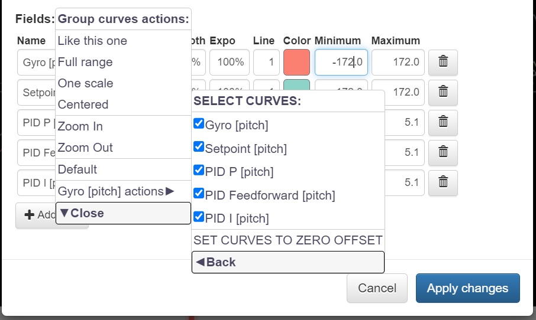

The 'Centered' extended submenu.
You can select curves what you need by using the checkboxes to centered.
Click 'SET CURVES TO ZERO OFFSET' item for apply
Click 'Back' menu item to go back to main menu.
Click 'Apply change' or 'Cancel' button on the main 'Configure graphs' dialog box to close the menu and dialog box immediately
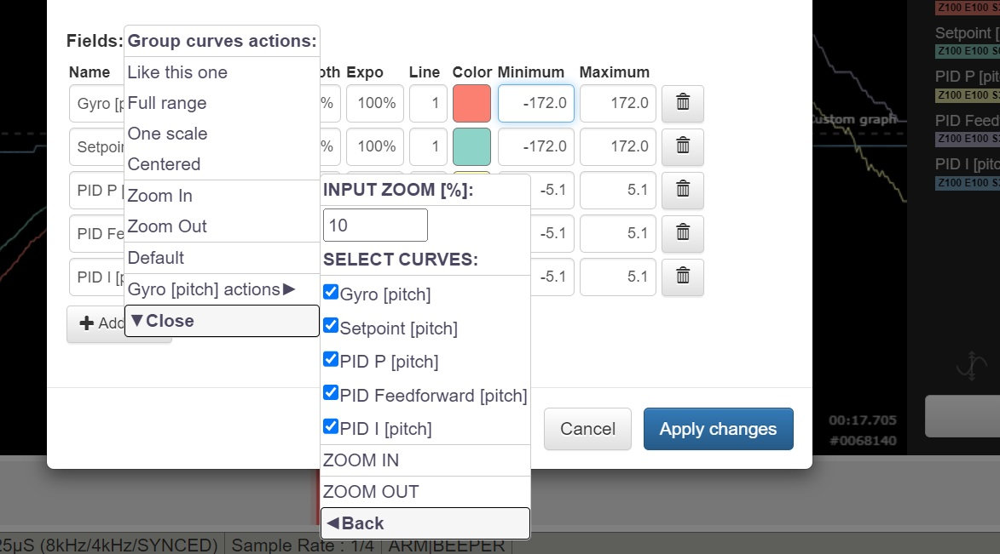

The single curve submenu has one 'Full range' extended item:
It is like 'Full range' extended submenu, but for one selected curve only.
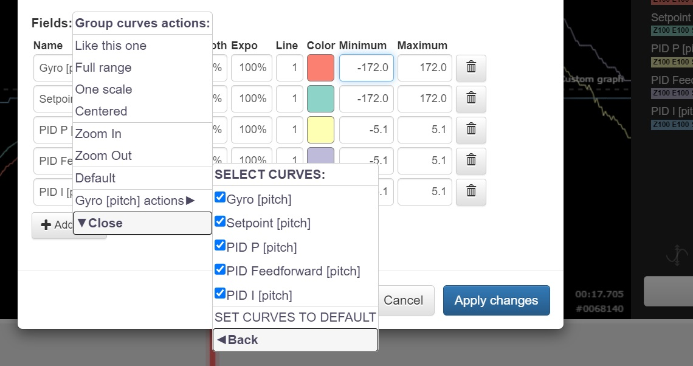

If you open context menu for one curves chart, then you see the short menu:
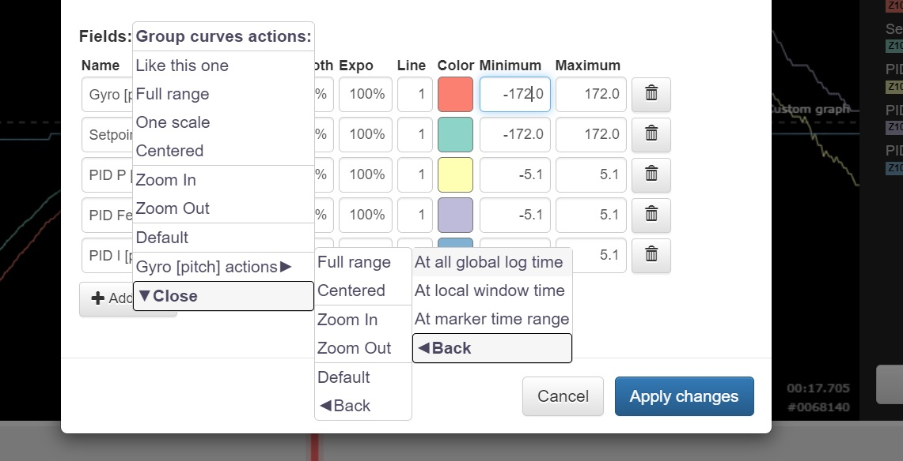
