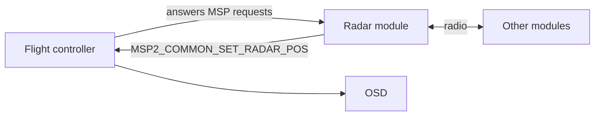

# Radar

Radar shows your flying friends on the OSD. You see where they are, how far, and how much higher or lower.

Each aircraft carries a small radio module. The modules share GPS positions. Betaflight draws the other aircraft on your OSD.

:::note
Radar was added in Betaflight 2026.12. It uses the same modules and the same MSP message as INAV. Betaflight and INAV aircraft can see each other.
:::

## What You Need

- A working GPS and an OSD.
- A free UART.
- A radar module on every aircraft. All modules must run the same firmware.
- A flight controller with at least 1 MB of flash. Smaller targets, like STM32F411 and STM32F722, do not include radar.

## Supported Hardware

Betaflight works with two module projects:

| Project              | Hardware                                               | Links                                                                                                            |
| -------------------- | ------------------------------------------------------ | ---------------------------------------------------------------------------------------------------------------- |
| **FormationFlight**  | ESP32 and ESP8285 LoRa boards, and many ELRS receivers | [formationflight.org](https://formationflight.org), [GitHub](https://github.com/FormationFlight/FormationFlight) |
| **ESP32 INAV-Radar** | ESP32 LoRa boards                                      | [GitHub](https://github.com/OlivierC-FR/ESP32-INAV-Radar)                                                        |

FormationFlight is the newer project. Use it for a new build. ESP32 INAV-Radar is the original and is no longer developed.

For boards, flashing and module settings, see the project pages.

INAV describes the same feature here: [OSD Hud and ESP32 radars](https://github.com/iNavFlight/inav/wiki/OSD-Hud-and-ESP32-radars).

## Setup

1. Wire the module to a free UART. Module TX goes to UART RX. Module RX goes to UART TX. Add 5 V and ground.
2. In the **Ports** tab, enable **MSP** on that UART at **115200** baud. Save.
3. In the **OSD** tab, enable **Radar Peer**, **Radar HUD**, or both.
4. Power up outdoors. Wait for a GPS fix on each aircraft.

## How It Works

The module talks MSP to the flight controller. The module always asks. The flight controller only answers.

1. The module asks the flight controller for its own position.
2. The module sends that position to the other modules by radio. It receives their positions.
3. The module sends each other aircraft to the flight controller with `MSP2_COMMON_SET_RADAR_POS` (`0x100B`).



The message is 19 bytes:

| Offset | Size | Field                                     |
| ------ | ---- | ----------------------------------------- |
| 0      | 1    | Peer id                                   |
| 1      | 1    | State: 0 = undefined, 1 = armed, 2 = lost |
| 2      | 4    | Latitude, degrees x 10,000,000            |
| 6      | 4    | Longitude, degrees x 10,000,000           |
| 10     | 4    | Altitude above sea level, cm              |
| 14     | 2    | Heading, degrees                          |
| 16     | 2    | Speed, cm/s                               |
| 18     | 1    | Link quality, 0 to 4                      |

Betaflight keeps peers with id 1 to 8. Each peer gets a letter: id 1 is `A`, id 2 is `B`, and so on. The message has no name.

A peer disappears when the module reports it lost, or after 5 seconds with no update.

## OSD Elements

### Radar Peer

A readout in a fixed place. It shows one peer at a time, for example `←B 199m ▲30m`:

- an arrow pointing to the peer,
- the peer's letter,
- the distance,
- the height difference.

With more than one peer, it moves to the next one every few seconds.

### Radar HUD

Each peer is drawn where it is in your camera view.

- The marker is the peer's letter and an arrow.
- The line below alternates between height difference and distance.
- A peer outside your view sits at the left or right edge. Turn that way to see it.
- A peer above or below your view sits at the top or bottom, in the right column.
- Two peers in the same spot are stacked.

Set your camera's field of view and uptilt in the CLI, so the markers line up with the picture.

This element ignores its position in the OSD tab.

:::note
The HUD does not avoid your other OSD elements. A marker can cover another element while they overlap. The HUD keeps a margin free at the screen edges. Keep your other elements near the edges.
:::

### Heading

Radar needs a GPS fix and a heading it can trust.

- With a magnetometer, it works as soon as there is a GPS fix.
- Without one, fly forward for a few seconds first.

Until then, Radar Peer shows `-` and the Radar HUD is empty.

## CLI Settings

These settings are only in the CLI. The defaults match INAV.

| Setting               | Default | Range      | Meaning                                       |
| --------------------- | ------- | ---------- | --------------------------------------------- |
| `radar_peer_time`     | 3       | 1 - 10     | Seconds Radar Peer stays on each peer         |
| `radar_hud_max_peers` | 4       | 1 - 8      | Most peers on the HUD at once                 |
| `radar_hud_range_min` | 3       | 1 - 30     | Hide peers closer than this, in metres        |
| `radar_hud_range_max` | 4000    | 100 - 9990 | Hide peers further than this, in metres       |
| `radar_hud_alt_time`  | 3       | 0 - 10     | Seconds the HUD shows the height difference   |
| `radar_hud_dist_time` | 3       | 1 - 10     | Seconds the HUD shows the distance            |
| `radar_camera_fov_h`  | 135     | 60 - 150   | Camera horizontal field of view, in degrees   |
| `radar_camera_fov_v`  | 85      | 30 - 120   | Camera vertical field of view, in degrees     |
| `radar_camera_uptilt` | 0       | -40 - 80   | Camera uptilt, in degrees                     |
| `radar_hud_margin_h`  | 3       | 0 - 4      | Columns kept free at the left and right edges |
| `radar_hud_margin_v`  | 3       | 1 - 3      | Rows kept free at the top and bottom          |

The element positions are `osd_radar_peer_pos` and `osd_radar_hud_pos`.

Example for a 120 degree lens with 30 degrees of uptilt:

```
set radar_camera_fov_h = 120
set radar_camera_uptilt = 30
save
```

## Limits

- Betaflight remembers up to 8 peers. INAV remembers 5.
- The Betaflight HUD shows 4 by default, and up to 8. The INAV HUD shows up to 4.
- A FormationFlight group has up to 6 aircraft, including yours.

## Differences From INAV

- The HUD uses the whole OSD width. It also looks right on HD systems.
- Betaflight does not show INAV's signal bars or peer heading marks. Its font has no glyphs for them.

## Troubleshooting

- **No radar elements in the OSD tab.** The firmware has no radar. This happens on targets with less than 1 MB of flash, and on builds without GPS or OSD.
- **Radar Peer shows `-` and the HUD is empty.** There is no GPS fix, no peer, or no trusted heading yet. Without a magnetometer, fly forward for a few seconds.
- **No peers appear.** Check that MSP is on for the right UART at 115200 baud. Check that RX and TX are crossed. Check that the module sees the other modules.
- **A peer is in the wrong place on the HUD.** Set the camera field of view and uptilt to match your camera.
